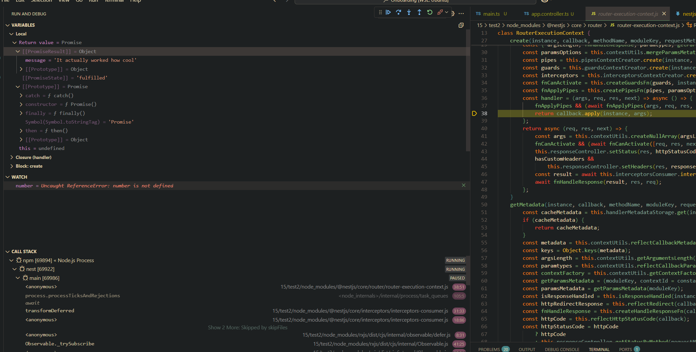
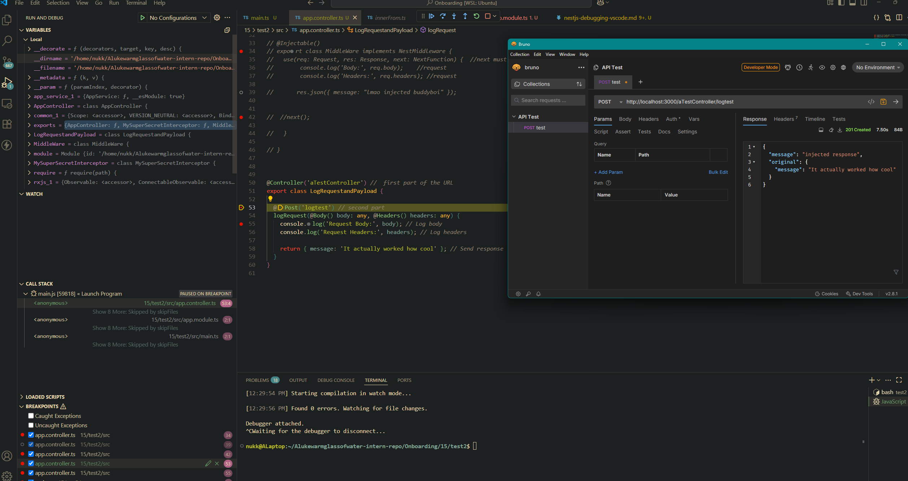
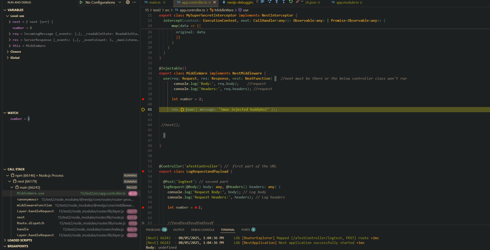

# How do breakpoints help in debugging compared to console logs?
- Breakpoints stop the program before it runs a specific line of code. This can be useful as the programmer is able to watch changes in variables to see if the line of code is trempremental and is what is causing bugs upstream. 

# What is the purpose of launch.json, and how does it configure debugging?
- Launch.json is stored in the root of the .vscode folder and it tells vscode what to launch and how to configure itself when debugging is enabled by the user. It also tells VScode how to launch the application, what file the program starts from, breakpoint mapping if required and, in this case with a NextJS project, if it is typescript or javascript. 

# How can you inspect request parameters and responses while debugging?
- Add a breakpoint inside the controller and or middleware, particulalry in @Get or @Body decorators. The parameters will appear in the leftsidebar. Message response sent can be seen in below screenshot.

# How can you debug background jobs that don’t run in a typical request-response cycle?
I would add a log to the console line after the line of code runs, capturing the variables it modifies and or add a debugger; line so the code stops at the breakpoint. That way you can see how the code is modifying the varaibles/database values before they are requested/resonded and therefore catch bugs outside of vieweing the raw http request/reponse.

 Attempting to debug my basic NestJS project I found that VSCode will sometime move breakpoints around. After googling this it seems to be due to source-map mismatches between the compiled background JS code and its Typescript equivalent.  

# Actually working evidence:

Debugger working:

Watch variables working:
