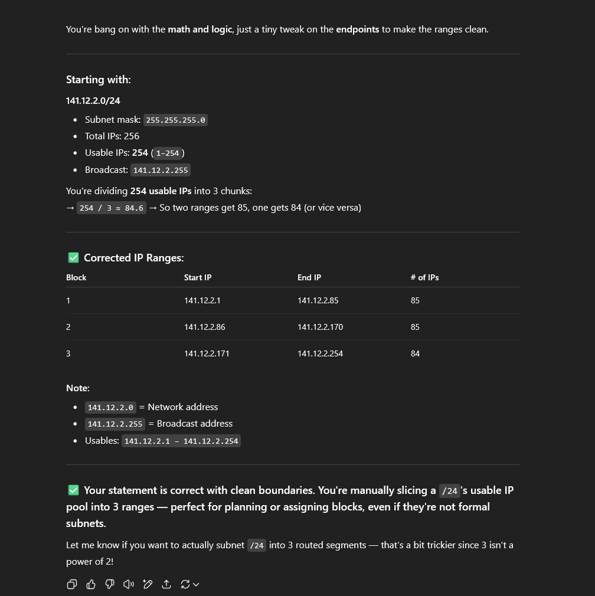

**Research & Learn**

- What AI tools are typically used for your role?
-- Github copilot, ChatGPT generated templates, Claude progamming focused AI.

- What are the benefits and risks of using AI in a professional setting?
-- Increased efficiency in the workplace and quicker goal completion. Privacy breaches are a risk if confidentail workplace data is fed to the LLM. Overreliance on AI may lead to lack of skill in the individuals role. Potential content generated may be innacurate leading to a poor outcome for the individual. 

- What types of information should never be entered into AI tools?
-- Intellectual property. Personally identifiable information. Personal financial information.

- How can you fact-check and validate AI-generated content to ensure accuracy?
-- Output can be cross-referenced with valid sources. Potentially have a co-worked to look over the content to validate its accuracy. 

**Reflection**

- When should you use AI for assistance, and when should you rely on your own skills?
-- Repetitive tasks and or summaries of information. Tasks that require critical thinking should be left up to your own skill. 

- How can you avoid over-reliance on AI while still benefiting from it?
-- Do not blindly copy and paste. Ask AI to explain concepts and or check your own work. Specifically ask it to not just give you the answer but guide you along to understanding it. 

- What steps will you take to ensure data privacy when using AI tools?
-- I will not enter any confidential data and or intellectual property into AI tools. I will check the companies AI tool policy and make sure my use aligns with said policy. 

**Task**

- Identify one task you can improve using an AI tool, and try it out.
-- Ask an AI tool what is the correct splitting for a subnet.

- Review the AI-generated output critically—did it require editing or fact-checking?
-- In this case it did require fact-checking as the output was incorrect. Image included. 

I learn't that you cannot always trust the output AI gives you even if it is adamant it is correct. Ai has the potential to hallucinate and do its best to convince you its output is correct even when it isn't.

 Document one best practice you will follow when using AI tools at Focus Bear.
-- Double-check AI generated output is accurate and valid before making use of it either in the workplace or sharing it with other team members. 