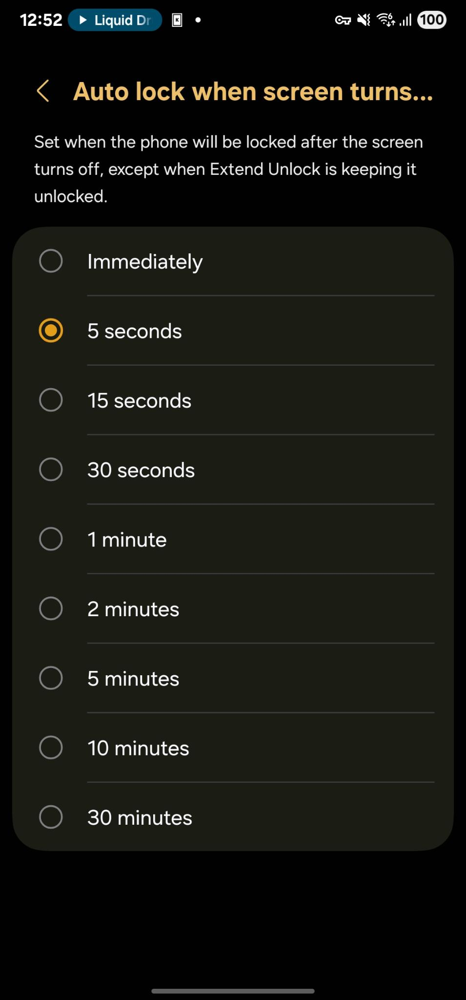
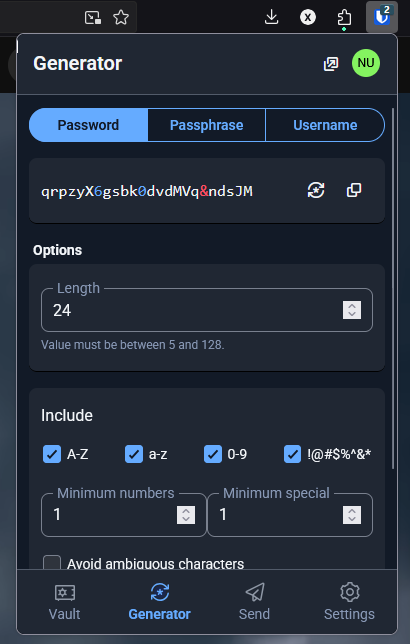

**Research & Learn**

- What are common cyber security threats in a remote work environment?
-- Phishing, malware and social engineering. Possibly unsecured home networks allowing access to corporate equipment potentially compromising the business. IT team is unable to monitor and safeguard home equipment, increasing the risk to the business. 

- What are best practices for keeping your devices and accounts secure?
-- Device operating systems up to date as well as applications. Strong, special-character passwords managed by a password manager as well as 2FA enabled for login. Use a VPN if working on public wifi. Lock device when not in use.

- Why is it important to lock your computer when away from your desk?
-- Malicious individuals are unable to easily gain access to company data/secrets. Potentially place backdoors on work machine leading to a bigger cybersecurity breach for the company. 

- How should you handle phishing attempts and suspicious links?
-- If the email is from a business, the business should be contacted to confirm that the link is legitimate. If this is not possible, then the email should be screened by the internal I.T. team. 

- What makes a strong password, and why should you use a password manager?
-- Large amount of special characters, with numbers and switching case. Complex passwords are difficult to remember, and as such, less likely to be used. A password manager stores these complex passwords allowing the user to use them as easily as possible. 

- Why is two-factor authentication (2FA) important, and when should you enable it?
-- 2FA is a safeguard against malicious activity by confirming with the legitimate user that the login attempt is form them and them alone. It should be enable to prevent account access to used that are not the account owner. 

**Reflection**

- What security measures do you currently follow, and where can you improve?
-- All of the above is currently followed. I could improve by moving back to a linux-based operating system, installing more up to date IDS/IPS technology in my home network, make use of a reverse proxy server on my home network and flash my smartphone with a custom android fork that is privacy oriented. 

- How can you make secure behaviour a habit rather than an afterthought?
-- Simply integrate them into your daily routine. Everytime I leave my computer I habitually lock it. My smartphone is set to auto-lock after 15 seconds of inactivity. Possibly read cybsec newletters to stay informed of the current threats and implement convenient cybsec practicies as to safeguard against them.

- What steps will you take to ensure your passwords and accounts are secure?
-- Implement 2FA on all accounts where possible. 24 character length passwords at a minimum as well as make use of an email proxy service so official email account, if said login credentials are accessed, is not compromised. 

- What would you do if you suspected a security breach or suspicious activity on your account?
-- Inform the I.T. team of the company I am working for. 

**Task**

- Ensure your work accounts have strong passwords and enable 2FA where possible.
-- Will be done once instructed. 

- Review your password storage method—if you’re not using a password manager, consider setting one up.
-- Use a password manager.

- Set up your computer and phone to automatically lock (require a password or biometric login) if you are away for more than a few minutes.

- Document one new cyber security habit you will follow at Focus Bear.
-- Will use 24 character passwords for all work accounts as well as 2FA. Will also report suspicous activity immeditaelly to the appropriate party. 

e.g 24 character password creation.

