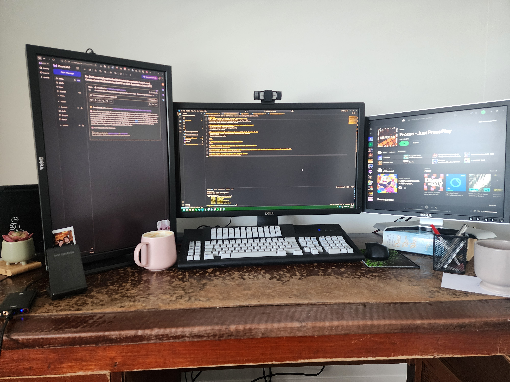
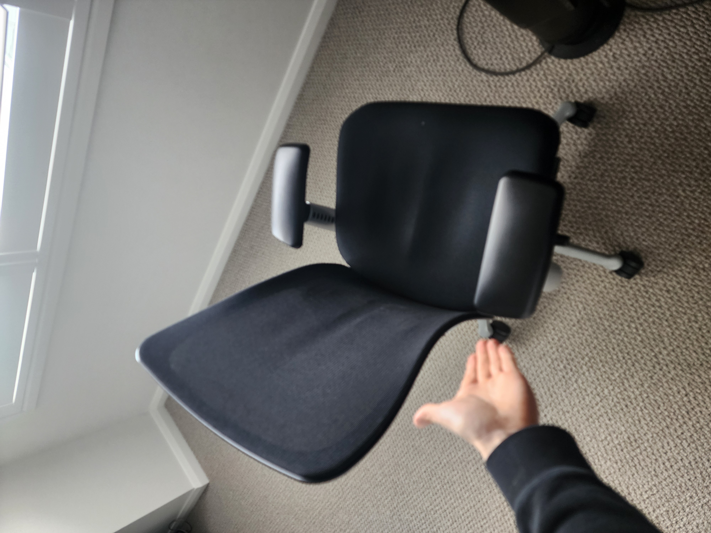

# Research & Learn

## What are the risks of using a laptop without an external monitor or keyboard?
- Poor posture both back and neck
- RSI in wrists
- Eye strain

## What ergonomic equipment can improve posture when working on a laptop?
- Laptop stand
- External input devices
- Ergonomic chair
- Sit/stand desk

## What adjustments should be made to monitor height, chair position, and desk setup?
- Monitor should be at or just below eye level and about an arm’s length away
- Chair height should allow feet to rest flat on the floor with knees at 90 degrees
- Desk height should allow elbows to rest at a 90-degree angle when typing
- Potentially use a footrest

## What are some daily habits that reduce the impact of prolonged laptop use?
- 30 minut movement breaks
- 20 20 20 rule. Every 20 minutes look at something 20 meters away for 20 seconds
- Short wellbeing walks between tasks

# Reflection

## What equipment changes can you make to improve your workspace setup?
- Use a laptop stand to raise the screen to eye level
- Connect an external keyboard and mouse for better arm and wrist positioning
- Adjust chair height to enforce an engonomic posture

## What behavioural changes can you implement to improve posture and reduce strain?
- Sit upright with back supported and feet flat
- Take regular movement and breaks using a timer/app
- Perform posture self-checks

## How can you remind yourself to maintain good posture and take breaks throughout the day?
- Use Focus Bear to schedule recurring movement and posture break reminders
- Set hourly alarms
- Place a sticky note on monitor

# Task

## Adjust your laptop setup based on ergonomic best practices.
- Done

## Identify at least one piece of equipment that could improve your posture and comfort.
- Footrest. Currently do not have one.

## Try using posture and movement reminders for a full workday and note any improvements. (Hint: # Focus Bear has built-in reminders for movement breaks!)
- Did today and it worked well to keep me fresh and alert.

## Document at least one workspace change or habit adjustment you made.
- Adjusted monitor heights and chair to be more ergonomic. Makes interacting with my machine more straightforward and takes the straight off my neck and back. Making it easier to conduct longer work sessions. 

Photo proof:

 - Desk

 - Chair