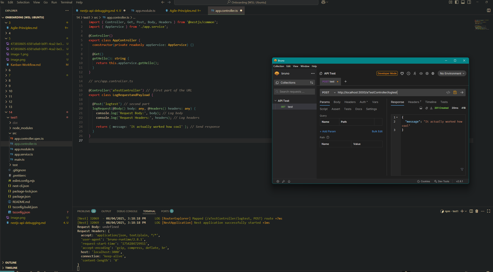

# 1. Research tools for inspecting API requests

- **Postman**: A user-friendly GUI for sending and inspecting HTTP requests.
- **Bruno**: An open-source alternative to Postman, fully local and Git-friendly.
- **curl**: A command-line tool to make HTTP requests (comes pre-installed on many systems).

# 2. Log request payloads and headers in a NestJS controller

# 3. Inspect API responses and verify HTTP status codes

- API response is provided in the below screenshot. 

It can be seen that the return is correct with what was written in the class return statement as well as 201 created can be seen. This indicates that the POST request executed successfully and something was created on the server side. 

# 4. Use middleware or interceptors to modify and analyze API responses

-- Middleware is a function that runs before the controller class is ran. So I guess I can modify the request by catching it before it hits the controller?

Evidence of the middleware class loggin and returning a different response than was was originally returned by the controller.

Tried an injectable. Will only run if no return occurs from the middleware. I guess that is because if the middleware runs and returns then the controller is never hit by the request and therefore the injectable wont run.

# Reflection

## How can logging requests help with debugging?
- Understand what client is sending and why it may be being process incorrectly. Potentially it is a data type you didn't account for.
- Reproduce bugs if a certain input is causing a crash

## What tools can you use to inspect API requests and responses?
- Postman
- Bruno (What I chose)
- curl
- Thunder Client (API client that is a VSCode extension)

## How would you debug an issue where an API returns the wrong status code?
- Check if controller is set to return an incorrect response code
- Check if there is middleware or an interceptor that is modifying the response
- Log data and see if any evidence in the body or header of the request can help narrow down the issue

## What are some security concerns when logging request data?
- Potentially passwords and or sensitive data sent in the HTTP request such as names/emails etc...
- If logs are easily ottainable then this could be an entry point for malicious groups to obtain access to data and how the backend functions. 