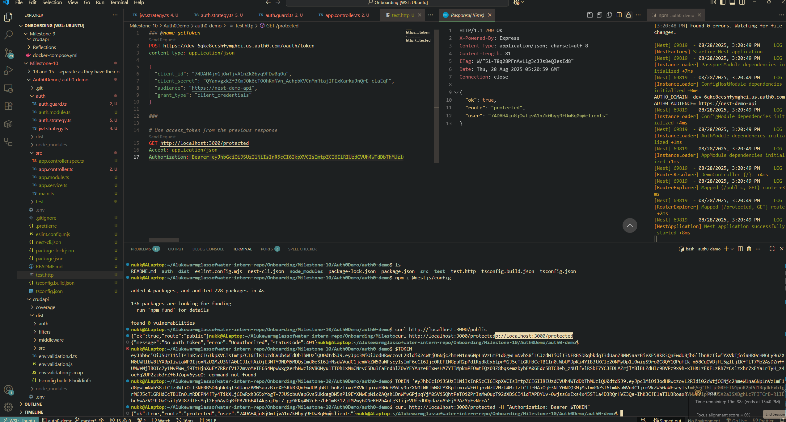

# OAuth working throught NestJS demo app

# Auth0 Authentication vs Traditional Username/Password

- **Traditional Auth**:
  - Application stores and validates user credentials (username/password).
  - Requires secure storage of said credential.
  - Application itself is responsible for the security and storage of these credentials.

- **Auth0**:
  - Delegates authentication to an external Identity Provider (IdP).
  - Supports OAuth 2.0 / OpenID Connect flow.
  - App validates tokens of which query a IdP to user information.
  - Allows 'one login' to allow sign in everywhere.

---

# Role of JWT in API Authentication

- JWT (JSON Web Token) is a self-contained token containing user identity and claims.
- Issued by Auth0 provider after successful authentication.
- Sent in API requests via the `Authorization: Bearer <token>` header.
- Server verifies the JWT signature, issuer, and audience.

---

# How jwks-rsa and Key Verification Work in Auth0

- Auth0 signs tokens with its own private key (RS256 in this case).
- Applications verify tokens using the corresponding public key.
- `jwks-rsa` library automatically fetches the JSON Web Key Set (JWKS) from:  
  https://dev-6qkc8ccshfymghci.us.auth0.com/.well-known/jwks.json
- Passport/NestJS uses this JWKS to find the correct public key and validate token signatures.
- This ensures tokens cannot be forged, only Auth0 (holding the private key) can issue valid ones.

---

# Protecting an API Route (NestJS Example)

- I would store my AuthO API identifier in my .env file (both domain and audience)

- Then in my JWT strategy:
  - Check for a token in the header of the HTTP request.
  - Verify the token’s audience (match with API audience)
  - Verify the issuer (match with API issuer).
  - Checks signature automatically with keys from Auth0 JWKS public key endpoint.
  - If the token passes all checks, the user information inside the token is returned and attached to req.user.

- Guard will then check if token is valid before the controller route runs.
  - Does this via the AuthGuard() function. (parse in 'jwt')
  - From there could potentially add a second guard to check the role retured by req.user so further authentication of the routes based on user role (e.g. admin, regularuser, helpdesk etc.) can be performed.

- Controller JWT protected route runs the guard from beforehand. If it fails then a "401" unauthorized error is returned to the user.
