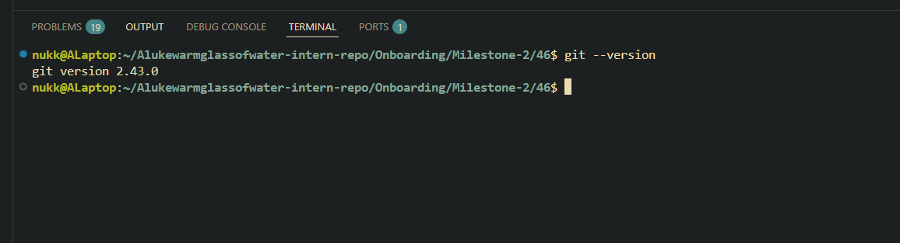

# Git Reflection

# Have you used Git before? If so, in what context?
- I have mainly for cloning other peoples repo's so I can install linux software. However this was done rarely. I have attempted to use it in past projects for university but difficulty in understanding how to use it from both myself and my group would lead us to abandon it for easier alternatives.

# Which Git client (if any) did you choose? Why?
- Git running in ubuntu WSL. Familiar with the Linux environment, supports npm. 

# What was the most interesting thing you learned about Git today?
- Finally seem to understand how branching in Git works.
- Origin is the repo you initially pulled from. No correspondance from the MAIN branch on Github. 
- Made my first pull request! 

### Git installed evidence:

