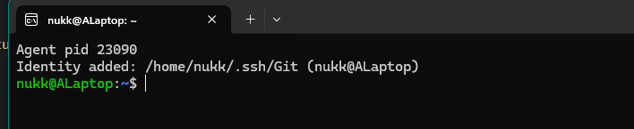
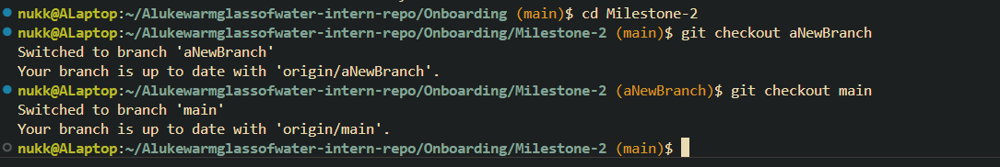

### Terminal Reflection

**Which terminal client did you choose? Why?**  
I chose the WSL Ubuntu terminal because it gives me a full Linux environment within Windows. The native linux environment is what I've been using with Git and installing packages so I thought it would be easier for me to get a grips with then switching to Windows. 

**What customizations (if any) did you make?**  
- Had to edit bash .initrc to make sure SSH agent is running and keys were added everytime WSL starts or it fails to authenticate correctly with Github. 

- Used https://hinty.io/ivictbor/show-git-branch-in-bash-on-linux-windows-wsl-2-cygwin-prompt/ to show git branches in terminal.

**What was the most useful command you learned today?**  
- `git checkout` – for switching branches  
- `git merge` – to bring changes from one branch into another  
- `touch` – to quickly create new Markdown files  
