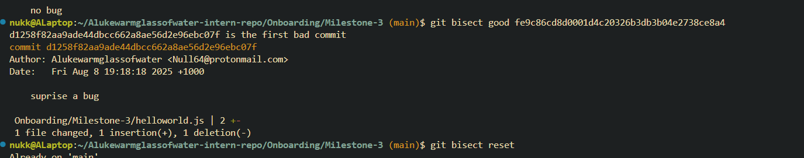
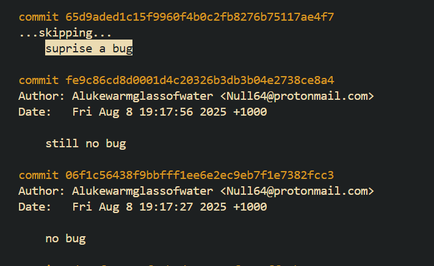
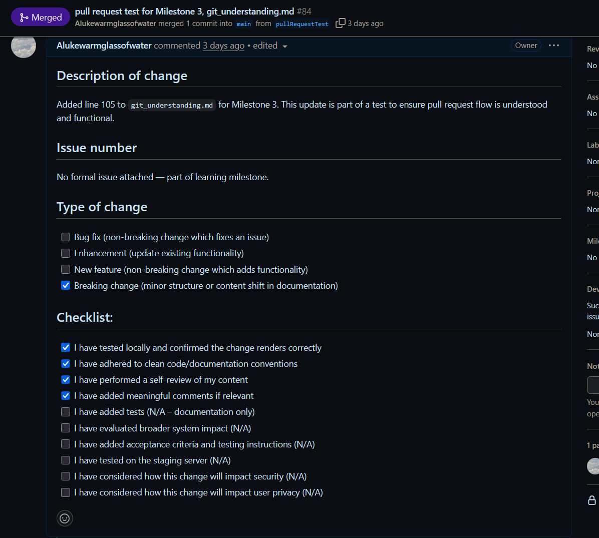

# Git concept: staging vs committing

### What is the difference between staging and committing?

- Staging allows you to select files or parts of files you intend to track the changes of. Once git add is ran the files are said to be in the staging area. Commiting is made after you stage files and is a record of the state of the files in the staging area at that specific point in time.

### Why does Git separate these two steps?

- Helps you avoid uneseccary commits.
- Allows you to carefully select what will get commited. Don't have to include unecessary junk files if they are any for example.
- Can also use the staging area to see what is different between what you staged and what you changed (if you made some changes to a staged file and it broke the code for example).
- Staged files stay staged. If you are working on files and, for whatever reason, forget what files you changed, they will be tracked in the staging area.
- Can track file changes after staging, therefore can revert to the staged version if unecessary changes were made to the file post-staging.

### When would you want to stage changes without committing?

- When you've made multiple unrelated changes and want to commit them separately. You can stage just one group of changes now and come back to the others later.
- When you're not done yet but want to save a clean version of certain files.
- To carefully prepare a commit.

# Branching & Team Collaboration

### Why is pushing directly to main problematic?

- It can introduce broken code into main.
- It bypasses code review, allowing unverified code into production.
- It increases the risk of merge conflicts, especially in teams.
- It makes it harder to isolate bugs or roll back specific changes.

### How do branches help with reviewing code?

- Branches allow for programming to be done and changes to be made without effecting the main branch.
- Code can be reviewed through pull requests before merging into the main branch.
- Reviewers can leave comments and suggestions on specific lines of code.
- Helps maintain a stable main branch.

### What happens if two people edit the same file on different branches?

- If in different parts of the file, normally merged automatically.
- If the edits are on the same line then Git will raise a merge conflict and the end user has to edit said line themselves to clear it.

# Advanced Git Commands & When to Use Them

### What does each command do?

- git checkout main
  Restores the version of a specific file from the main branch into your current branch. This overwrites the working directory copy of the file without affecting any other changes or files.

- git cherry-pick <commit>  
  Applies a specific commit from another branch onto your current branch. It brings in just that one commit's changes without merging the entire branch.

- git log
  Shows the commit history of the current branch. Useful for seeing what changes have been made, by whom, and when, along with commit messages.

- git blame <file>  
  Shows who last modified each line in a file and the corresponding commit hash. Useful for tracking down when and why a particular line was changed.

  ***

### When would you use it in a real project?

- git cherry-pick
  Useful when you want to bring a specific bug fix or feature commit from one branch (e.g., `dev`) into another (e.g., `main`) without merging the entire branch. Especially helpful in hotfixes or long-lived branches.

- git checkout  
  Used constantly: to switch branches, restore specific files, or roll back changes from a different branch. Essential for managing context during development.

- git stash  
  Handy when you’re in the middle of work but need to quickly switch tasks, pull updates, or change branches without committing half-done changes.

---

### What surprised you while testing these commands?

Git cherry-pick was confusing. I cherry-picked a commit from a new branch into main, but later when I restored that file using git checkout, I still got the version from the cherry-picked commit—even though I thought the change was already integrated.

# Evidence of me using the commands:

851 git add git_understanding.md
852 git commit-m "Milestone2 - 55"
853 git commit -m "Milestone2 - 55"
854 git checkout main -- git_understanding.md
855 git cherry-pick aNewBranch
856 git revert 50fd216
857 git log
858 git blame git_understanding.md
859 git checkout main git_understanding.md
860 git checkout aNewBranch
861 git add git_understanding.md
862 git checkout aNewBranch
863 git commit -m "more changes"
864 git checkout aNewBranch
865 git commit
866 git add ./
867 git commit
868 git cherry-pick adfs
869 git cherry-pick 4e24a49
870 git push
871 git cherry-pick 4e24a49
872 git cherry-pick --continue
873 git cherry-pick 4e24a49
874 git checkout main
875 git cherry-pick 4e24a49
876 git add git_understanding.md
877 git cherry-pick --continue
878 git puish
879 git push
880 git checkout git_understanding.md
881 git add git_understanding.md
882 git commit -m "Milestone3 - 57"
883 git push

# Understanding git bisect:

Git bisect evidence:

### What does git bisect do?

`git bisect` helps you find the exact commit that introduced a bug by going through your commit history. You mark one known good commit and one known bad commit, and Git checks out commits in between for you to test. Based on your good/bad input it helps you find the commit where the bug was introduced.

### When would you use it in a real-world debugging situation?

- A bug appeared, but you don't know when it was introduced.
- The project has a complex commit history and manually reviewing each one would take too long.

### How does it compare to manually reviewing commits?

- It uses a binary search approach, finding the buggy commit quicker than manually searching would. It also automatically checkout's your commits for you, reducing chance of human error.

### Evidence of the commit messages I made:

I edited my test.js file with characters to simulate me working on code. I commited 3 times with the final commit having changes that would result in a ficticious bug. I then used git bisect to mark the good and bad commits and find the commit where the 'bug' was introduced.

# Writing Meaningful Commit Messages

# Make three commits in your repo with different commit message styles:

- A vague commit message (e.g., "fixed stuff").
- An overly detailed commit message.
- A well-structured commit message.

- These commits can be seen in this screenshot:
  

### What makes a good commit message?

- A clear and precise report of what was done and why it was made. Possibly referencing an issue number on the repo.
- Follows a consistent format.

### How does a clear commit message help in team collaboration?

- Makes it easier for teammates to understand the purpose of a change without digging into the code.
- Helps new devs understand project history.

### How can poor commit messages cause issues later?

- Makes debugging harder when you don’t know why a change was made.
- Wastes time searching through commit history to find why a bug has occured.
- Increases the chance of reintroducing old bugs due to lack of context.
- Slows down onboarding of new team members who rely on commit history to learn the codebase.

- e.g. This is something I'd like to integrate into the main code base please.

# Pull Requests

### Why are PRs important in a team workflow?

- Pull Requests provide a way for proposed changes to be looked (and bugs catched) by other team members before they are integrated.
- All changes made to the codebase can be seen by others, aiding project transparency.
- They create a record of what was changed and why.
- I used a pull request to merge the changes of a file in a branch that diverged from my main code. When I approved the request github reported a merge conflict. This taught me how to resolve said merge conflict and how branches interact with the main code base.

### What makes a well-structured PR?

- A clear and descriptive title that summarizes the change.
- A detailed description explaining the purpose of the PR, what was changed, and why.
- Possibly a reference to a bug/issue proposed on the repository.
- Evidence of unit tests passing.
- I asked my supervisor how to format my pull request. I was given below as a result. From this I understand that there is more to pull requests than simply stating what you changed and why it should be integrated, especially when working on a project in the company environment.

# Pull request format for FocusBear:

## Description of change

## Issue number

## Type of change

- [x] Bug fix (non-breaking change which fixes an issue)
- [ ] Enhancement (update existing functionality)
- [ ] New feature (non-breaking change which adds functionality)
- [x] Breaking change (fix or feature that would cause existing functionality to not work as expected)

## Checklist:

- [x] I have tested locally and linked a screen recording with this PR
- [x] I have adhered to clean code conventions
- [x] I have performed a self-review of my code
- [x] I have commented my code, particularly in hard-to-understand areas
- [ ] I have added tests that prove my fix is effective or that my feature works
- [ ] I have evaluated how the change will affect the system on broader level
- [ ] I have added acceptance criteria and testing instructions to the JIRA ticket
- [ ] I have tested on the staging server
- [ ] I have considered how this change will impact security
- [ ] I have considered how this change will impact user privacy

### What did you learn from reviewing an open-source PR?

- How in large projects such as Node, pull requests are formatted to a high standard whereas in smaller projects pull request quality suffers.
- There are so many pull requests in large, multi-dev projects, it is obvious why clear requests and issue tracking is extremely important.
- Short sharp messages if critique is required with evidence of the change/fix made in response.

## My own Pull Request:

