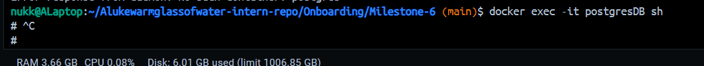
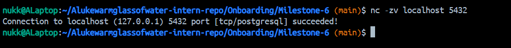

# Command list:

- docker ps – list running containers
- docker inspect <container> – view detailed container info
- docker logs <container> – show logs from a running container
- docker logs -f <container> – follow logs in real time
- docker logs --tail 100 <container> – show the last 100 log lines
- docker exec -it <container> bash – open an interactive Bash shell inside a container
- docker exec -it <container> sh – open an interactive shell (if Bash is unavailable)
- docker exec -it <container> <command> – run a one-off command inside a container

# Reflection

## How can you check logs from a running container?

- docker logs <containername>
- Can also do it via the docker.desktop GUI.

## What is the difference between docker exec and docker attach?

- Docker exec: Runs a new command inside an already running container. This creates a new process that’s separate from the container’s main process. For example: `docker exec -it myapp bash` opens a shell inside the container without affecting the main app process.
- Docker attach: Connects your terminal directly to the container’s main process (PID 1), sharing its STDIN/STDOUT. This gives you a live stream of what that process is doing. However, if you exit with CTRL+C, it may stop the container because you’re tied to its main process

## How do you restart a container without losing data?

-- `docker restart`
-- `docker stop/start`
--- Cannot use docker compose down as it removes the container in the process, deleting the writeable container layer.

## How can you troubleshoot database connection issues inside a containerized NestJS app?

- docker logs `<containername>`
- docker attach and watch the log files generated by the nestJS process?
- docker ps and see if the container is up.
- run database queries with `docker exec -it <nest_container> sh -lc "psql -h db -U focusbear -d testDB -c 'SELECT 1;'"` and see if a response comes back
- Inspect network settings of the running container with `docker inspect <nest_container> --format '{{json .NetworkSettings.Networks}}' | jq`
- Can increase nest logging to be more verbose in main.ts "const app = await NestFactory.create(AppModule, { logger: ['error','warn','log','debug','verbose'] });"

## Story of a debugging session with docker.

- When I first tried connecting a NestJS container to Postgres, I accidentally attempted to connect to a different database than the one defined in my `docker-compose.yml`. On top of that, I used `localhost` in the connection string. The app logs showed `ECONNREFUSED`, which didn't make sense at the time. Running `docker exec -it postgresDB sh` confirmed postgresDB was running and then `nc -zv localhost 5432` in the docker CLI showed that the postgres service was actually reachable. Further troubleshooting revealred my mistake. In future I will always check database names and command arguments so this confusion can be avoided.

