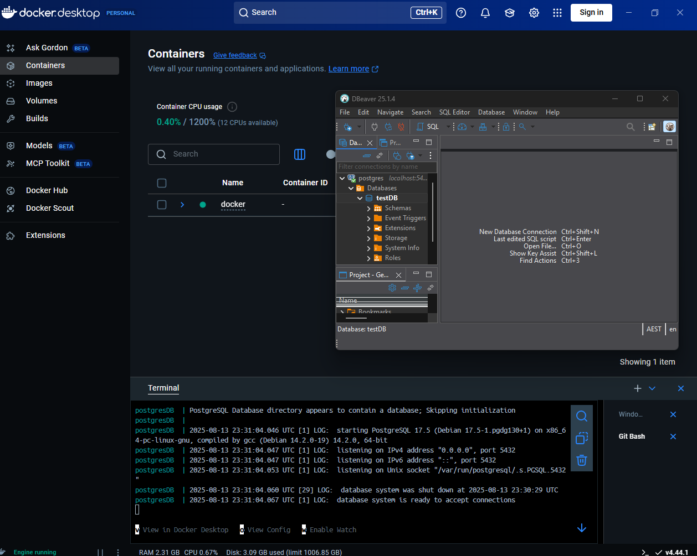

# Evidence:

## Reflection:

### What are the benefits of running PostgreSQL in a Docker container?

- It's a portable PostgreSQL container that I can start and stop at my whim.
- docker-compose allows me to run multiple instances of different versions of docker containers if I require it.
- Allows my environment to be sand boxed, in terms of software versions/installed packages, so I can be sure an update won't break my dev environment.

### How do Docker volumes help persist PostgreSQL data?

- If my docker container fails for whatever reason than the docker volume will remain intact. As docker containers are ephemeral, it ensures that my data won't disappear
  /become corrupted in event of a technical issue.
- I can share the volume easily if required both between containers (specified in docker-compose file) and to other physical machines. Simply give the docker-compose file to someone, they spin up the container and place the volume in the same location as specified by `docker volume inspect myvolume` which should reveal the mountpoint used by docker. Stop all containers, delete the current volume data, place the copied volume data, create a new volume with the same name as the transferred volume. Containers should now see the transferred contents.
- Safely upgrade containers without touching the volume and or the data inside it.

### How can you connect to a running PostgreSQL cont?

- I use DBeaver and simply connect it to localhost at the port specified in my docker-compose.yml file (5432).
- You can also run the commands below and you'll enter the postgres CLI in the docker desktop terminal.
  -- `docker compose up -d`
  -- `docker exec -it postgresDB psql -U focusbear -d testDB`
