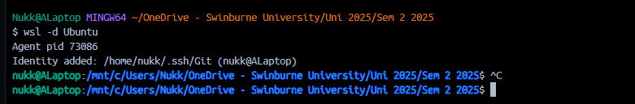
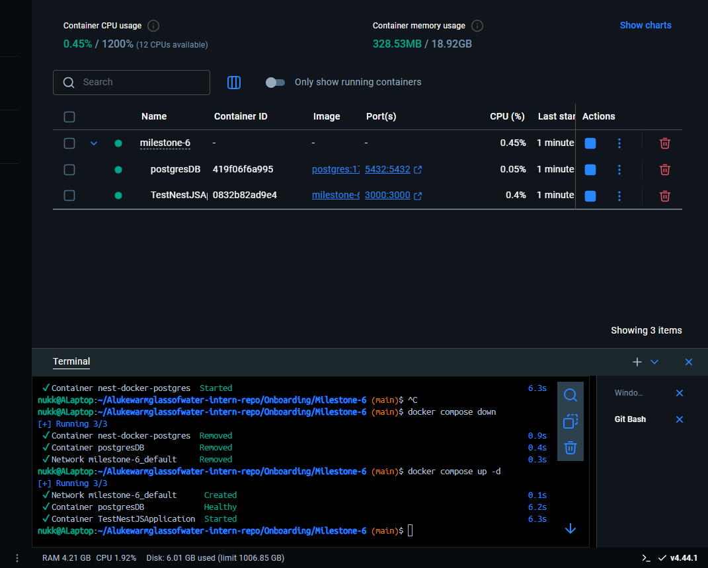
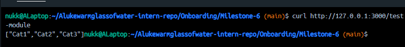
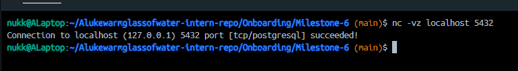

# Hop into WSL from Git Bash

wsl -d Ubuntu



# Everything seems to be running



## NestJS app running:



## PostgresSQL running:



# Reflection:

## How does a Dockerfile define a containerized NestJS application?

- Its a YAML file that specifies how to build and create an environment that allows the NestJS app to run.
- It defines the base image (e.g., `node:18`), installs dependencies, copies source code, builds the app, and specifies how to run it.
- Ultimately creates a portable image that can run in any environment with Docker installed.

## What is the purpose of a multi-stage build in Docker?

- Multi-stage builds let you separate the build environment from the runtime environment.
- The first stage installs dev dependencies and compiles the app, a.k.a the build environment.
- The second stage copies only the compiled output and required files. It removes the build environment so what is left is all that is needed for the NestJS app to run.

## How does Docker Compose simplify running multiple services together?

- Docker Compose uses a single `docker-compose.yml` file to define and run multiple containers as one application stack.
- It handles networking automatically.
- It allows defining dependencies, volumes, environment variables, and ports in one place.

## How can you expose API logs and debug a running container?

- **View logs**:

  ```bash
  docker logs -f <container_name>
  ```
