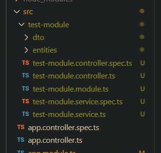
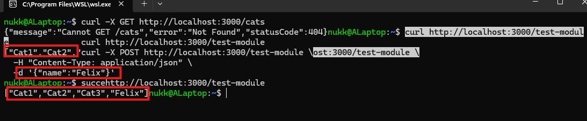

# New test-module module. (Don't write module in the name. Resolves to testmodulemodule which is confusing in the code)

# Response from NestJS

# Reflection:

## What is the purpose of a module in NestJS?

- Acts as a logical grouping for different functions in a NestJS application. E.g. appropriate controllers, providers/services, and imported/exported modules.
- Helps build many submodules in a NestJS app.

## How does a controller differ from a provider?

- Controller handles incoming requests and returns responses; defines routes (e.g., `@Get()`, `@Post()`).
- Provider (Service), Encapsulates business logic as well as data access and injected into controllers (and other providers) via DI.

## Why is dependency injection useful in NestJS?

- Classes don’t instantiate their own dependencies which makes it easy to re-use them in other classes.
- Without DI, Jest won't be able to function as it works on the principle of swapping the classes functions use with test functions.

## How does NestJS ensure modularity and separation of concerns?

- Features live in their own modules (`@Module`), which import/export only what’s needed.
- Controllers (transport layer) vs. Providers/Services ( logic) vs. Modules (organization/wiring).
- Due to the interconnected framework of Nest, components have to be specifically declared and registered with each other. Making inter-module connectivity well-structured by design.
- Exporting a module only expose what a feature intends to share, establishing boundaries throughout the codebase.
