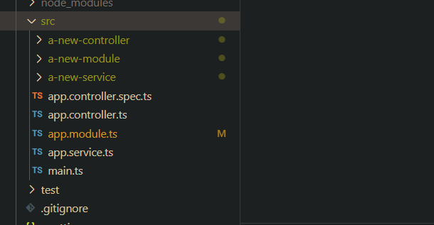

# **Notes**

## Commands:

`nest new <project-name>`
`npm run start`
`npm run start:dev - hot reload`
`npm run start:debug - debug mode`

`nest g module <name>`
`nest g controller <name>`
`nest g service <name>`

`nest build`
`npm run test`
`npm run test:e2e (run global tests in test/app.e2e-spec.ts)`

`nest g resource <newresource>` - creates subfolder and module,service and controller files as well as spec.ts files automatically
`nest generate` - 'g' as seen in previous commands is shorthand for generate
`nest build` - Compiles NestJS typescript source files in /src. Output placed in /dist.

# Evidence:

# **Reflection**

## How does the NestJS CLI help streamline development?

- Provides ready-made commands for creating, building, testing, and running a NestJS application.
- Automates repetitive tasks such as boilerplate code generation for modules, controllers, and services.
- Does TypeScript compilation.
- Reduces setup time as well as enforces NestJS best practices.

## What is the purpose of nest generate?

- Creates new NestJS components with `nest g resource` (modules, controllers, services, etc.) with the correct file structure and decorators automatically applied.
- Can also individually create modules, controllers and services.

## How does using the CLI ensure consistency across the codebase?

- Forces generation of files that have the correct structure and naming conventions.
- Also forces correct folder structure if using nest new or nest g resource.

## What types of files and templates does the CLI create by default?

### Module (`nest g module <name>`)

- `<name>.module.ts` – Contains an `@Module()` decorator with empty `imports`, `controllers`, and `providers` array(s).

### Controller (`nest g controller <name>`)

- `<name>.controller.ts` – Includes `@Controller()` decorator and placeholder methods for common routes (`GET`, `POST`, etc.).
- Automatically imports and registers in the nearest module.

### Service (`nest g service <name>`)

- `<name>.service.ts` – Contains an `@Injectable()` decorator and an empty class ready for business logic.
- Automatically adds it to the `providers` array in the nearest module.

### Gateway (`nest g gateway <name>`) _(for WebSockets)_

- `<name>.gateway.ts` – Includes `@WebSocketGateway()` and placeholder event handlers.

### Guard / Interceptor / Pipe / Filter (`nest g guard/interceptor/pipe/filter <name>`)

- Generates with correct decorator (`@Injectable()`) and a default method.

### Application (`nest new <name>`)

- Creates the full project scaffold:
  - `src/`
  - `test/`
  - `package.json`
  - `tsconfig`
  - `nest-cli.json`
  - Boilerplate files in /src: `main.ts`, `app.module.ts`, `app.controller.ts`, `app.service.ts`
