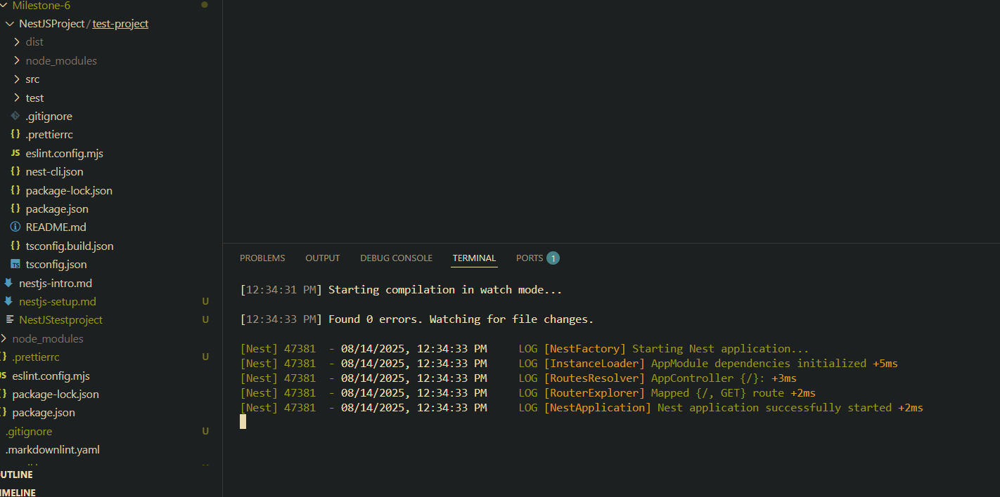
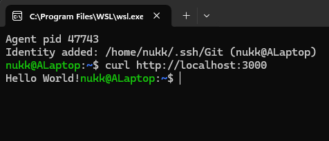

# Setup and endpoint testing proof:

### Install dependencies:

- `npm install -g @nestjs/cli`

### Initalize and run:

- `nest new testproject`
- `npm run start:dev`

# Reflection:

# Default NestJS Project Structure

## Files Included in a Default NestJS Project

- **`main.ts`** – The entry point of the application; responsible for bootstrapping the NestJS app.
- **`app.module.ts`** – The root module of the application; imports other modules and declares controllers/providers.
- **`app.controller.ts`** – Handles incoming requests for a sample route and returns responses.
- **`app.service.ts`** – Contains HelloWorld logic for the sample route.
- **`app.controller.spec.ts`** – A test file for the controller.
- **`app.service.spec.ts`** – A test file for the service.
- **`package.json`** – Contains package versions and configuration settings for the project.
- **`tsconfig.json`** – TypeScript configuration file.
- **`nest-cli.json`** – Configuration for the Nest CLI.
- **`node_modules/`** – Installed dependencies.
- **`test/`** – E2E (whole application) test files.

---

## How `main.ts` Bootstraps a NestJS Application

- Imports `NestFactory` from `@nestjs/core`.
- Creates an application instant from the root module (`AppModule`).
- Starts listening on a specified port for incoming HTTP requests (3000 by default).

---

## Role of `AppModule` in the Project

- Acts as the root module for the application.
- Uses`@Module()` to define:
  - `imports`: Other modules if extra features a required.
  - `controllers`: Classes that handle incoming and outgoing requests.
  - `providers`: Classes (most often services) that contain the business logic of the application.
- Serves as the main entry point for organizing and wiring up the app’s components.

---

## How NestJS Structure Helps with Scalability

- Features are grouped into modules, making it easier to add or remove functionality without affecting unrelated parts.
- Controllers handle HTTP layer, Services handle acutal logic, and Modules handle organization.
- Dependency Injection makes testing and swapping implementations straightforward.
- Strong convention/structure enforcing multi-person teams to abide by said structure.
