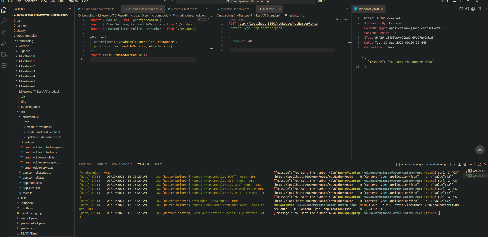

# Reflection

## What is the role of a controller in NestJS?
- The controller defines HTTP routes for CRUD requests. These controller routes can call services that take implement an input, do something with it, then normally return a response to the user. To define routes @Get, @Post etc... decorators are used. It is also common practice for the controller to be relatively small as all it does is call a service function for a particular HTTP request.

## How should business logic be separated from the controller?
- The controller simply receives input, calls the service that has been created. E.g. `return this.aTestService.create(input)` and returns the output back to the user. All business logic must remain inside the service `@Injectable`. 

## Why is it important to use services insteat of handling logic inside controllers?
- Services are where the actual business logic should live. The controller just calls a service function, rather than trying to handle everything itself. This makes the controller smaller and easier to read.

- Putting logic in a service also means it can be reused by multiple controllers, not tied to one route.

- It’s much easier to test a service in isolation compared to testing logic buried in a controller.

- As the app grows, keeping logic in services makes the code more maintainable and scalable, since you can update or replace a service without having to rewrite controller code.

## How does NestJS automatically map request methods (`GET, POST` ,etc) to handlers? 
- Those functions are mapped to handlers by writing the request method e.g. `@Post` followed by the route name (e.g. /atestroute), then the function call below with what is passed in (if JSON body value @Body(), or if user inpout @Param('id')) and what to return.

Endpoint testing working:

