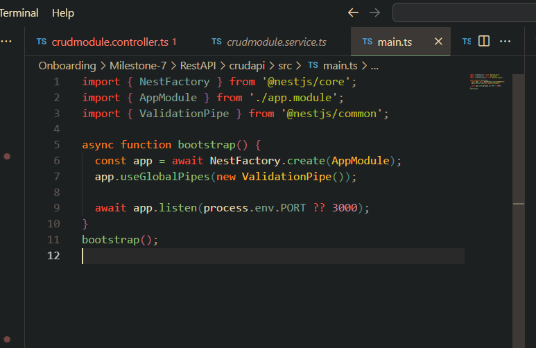
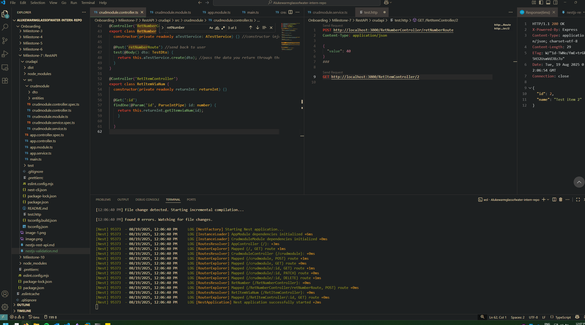
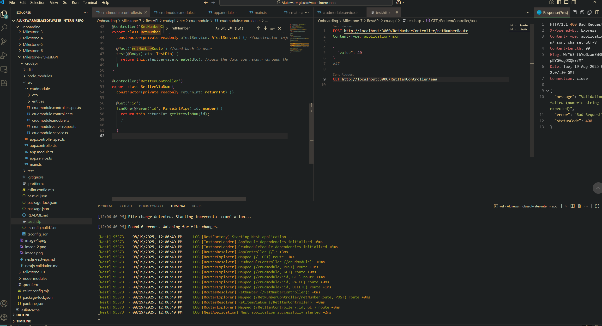
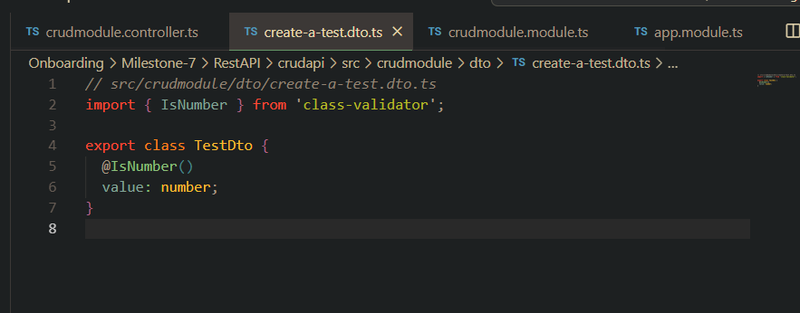

# Global validation pipe
- Enabling this enforces validation across all DTOs called by the controller

# ParseInt pipe working

## Expected number

## Incorrect input

## class-validator decorator in my DTO

# Reflection

## What is the purpose of pipes in NestJS?
- Pipes take an input and force either parsing or validation on said input. Pipes can be stacked together to create custom validation guards for specific user input. 
- The pipe always runs before the input is given to the controller.
- Can be combined with a DTO as to make sure the input given by the user is the correct structure. (forces only receiving of specified fields)

## How does ValidationPipe improve API security and data integrity?
- ValidationPipe checks the request body against the rules defined (by decorators) in the DTO before the service is hit.
- Say a user attempts to perform a code injection attack, we can use the `whitelist` pipe as to automatically remove user input that is not specified in the DTO. Without this an error will be thrown if input does not match the DTO structure exactly. This improves API security and data integrity as a result.

## What is the difference between built-in and custom pipes?
- Built-in pipes perform specific functions. E.g. `PartseIntPipe` only converts a string param to a number. If you wanted custom functionality you can build your own pipes via the `PipeTransform` interface which allows you to specify an incoming value and value metadata as to create additional logic based on the input type. The value returned then automatically replaces the original input. 

## How do decorators like @IsString() and @IsNumber() work with DTOs?
- They are included in the DTO and trigger to run via the `ValidationPipe` pipe that is called in the controller specifier for a particular route. An alternative is to call ValidationPipe globally via `app.useGlobalPipes(new ValidationPipe());` in main.ts.
- If there is a validation error Nest returns 400. 