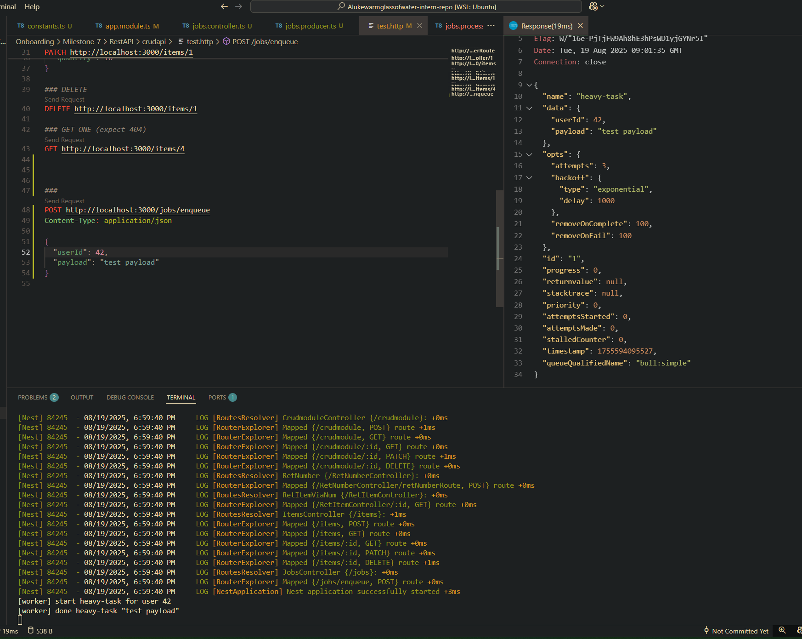

docker run -p 6379:6379 --name redis -d redis:7-alpine

# Queue running evidence:



# Reflection

## Why is BullMQ used instead of handling tasks directly in API requests?

- Non-blocking responses are used to offload slow/CPU-heavy or I/O-heavy work (emails, PDFs, video/image processing) so the API returns immediately.
- Jobs that are stored in Redis survive process restarts and can be resumed/retried.
- Retries can be configured as well as backoffs if faliure keeps occuring.
- Can run N workers in parallel whilst monitoring downstream usage so it doesn't become maxed out.
- Can delay jobs, run on a cron, and throttle throughput with built-in rate limiting.
- Bull board can be used to view job status.

---

## How does Redis help manage job queues in BullMQ?

- Job data is retained via Redis if a worked crashes.
- Job addition/removal is atomic. Duplicates can't happen.
- Workers get notified when new jobs show up, therefore don't need to continously poll for job availability.
- Easily scalable by creating more job processors when required.
- Job state tracking as previously mentioned helps manage the job que in BullMQ.

---

## What happens if a job fails? How can failed jobs be retried?

- Automatic retries can be configured per job:

  ```ts
  queue.add('task', data, {
    attempts: 5,
    backoff: { type: 'exponential', delay: 1000 }, // 1s, 2s, 4s, ...
    removeOnComplete: 100,
    removeOnFail: false,
  });
  ```

- Built in failure handling. If process() throws/rejects, BullMQ increments the attempt, applies backoff, and requeues until attempts are exhausted.
- If a worker dies mid-processing, BullMQ detects stalls and requeues the job.
- Fully-failed jobs remain in the failed state can can be inspected manually.

# How does Focus Bear use BullMQ for background tasks?

- Potentially to handle push notifications.
- Generate usage reports then notify when complete.
- Potential maintenenace tasks.
- Synchronizing data with other APIs,
- Potentially limit API polling rates for other services.
