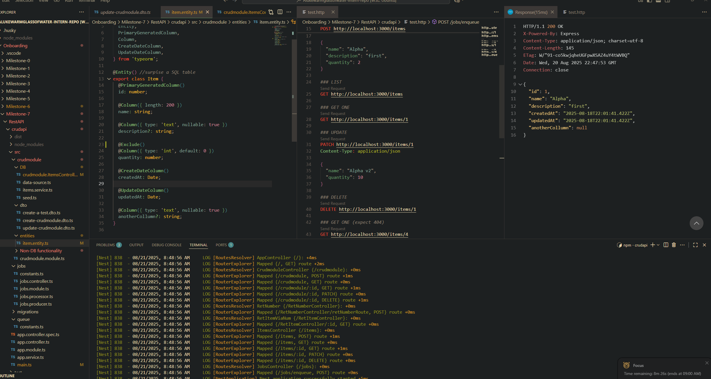
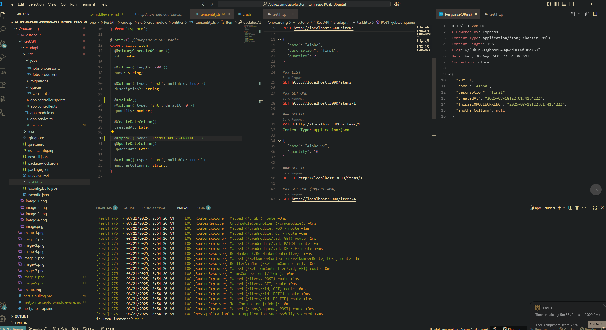
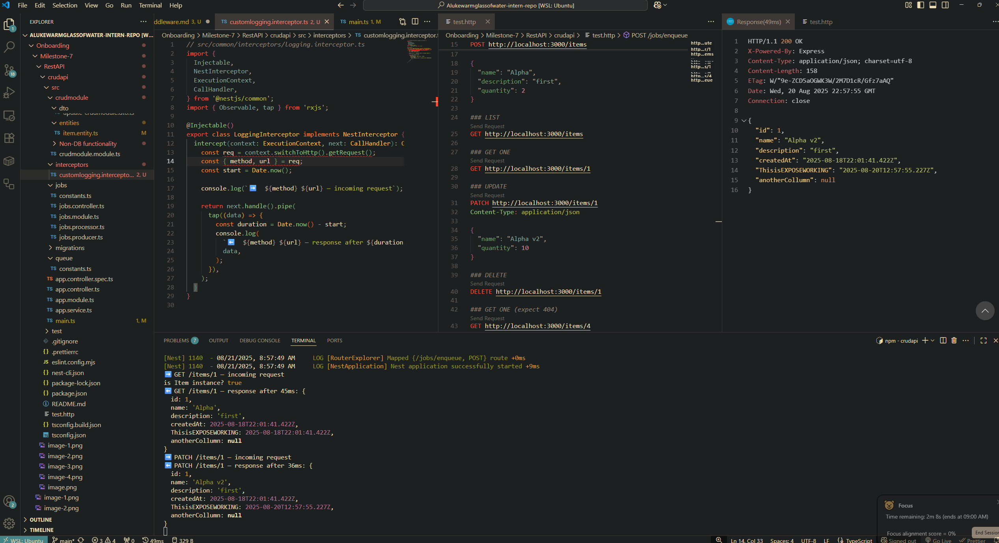
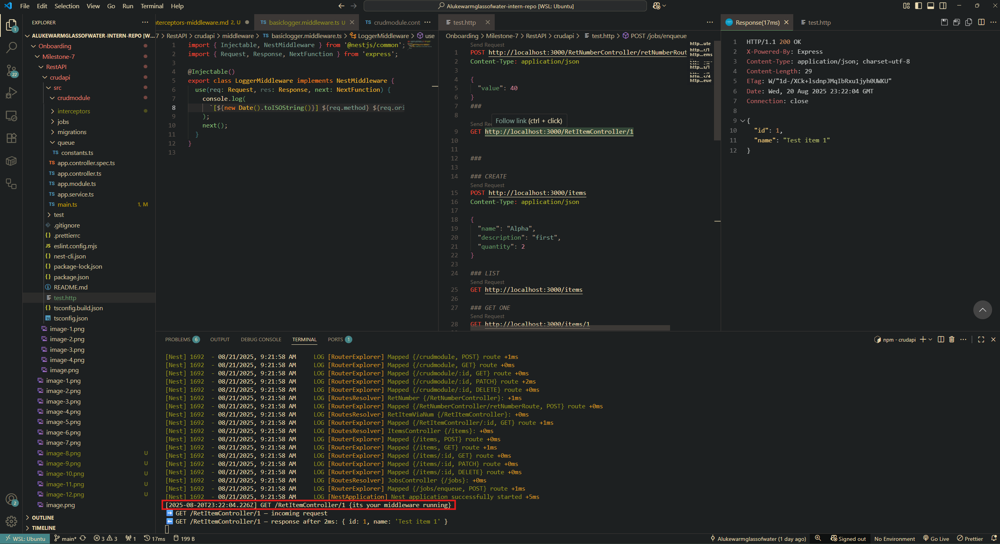

## What is the difference between an interceptor and middleware in NestJS?

- Middleware runs before a request hits your route handlers/controllers.  
  It’s good for things like authentication checks, request parsing, or attaching values to `req`.  
  Middleware has access to `req`, `res`, and `next()`, similar to Express/Koa.

- Interceptors run before and after method execution in controllers/services.  
  They can transform incoming arguments, modify outgoing responses, or wrap logic with extra behavior (like logging or timing).

---

## When would you use an interceptor instead of middleware?

- Use middleware when you want to affect the request/response cycle globally in a module. Can be globally for controller routes or a specific path.
- Use interceptors when you want to work inside Nest’s execution context, like:
  - Transforming data returned by a controller (both send and receive).
  - Adding additional metadata/logging around method calls.
  - Automatically mapping responses or handling errors in a consistent way.

---

## How does LoggerErrorInterceptor help?

- `LoggerErrorInterceptor` is a built-in NestJS interceptor for catching and logging unhandled errors that occur in your controllers.
- Instead of writing manual try/catch in every route, this interceptor:
  - Catches exceptions automatically.
  - Logs them with useful data (timestamp, route, stack trace).
  - Don't have to clog controller with logging logic.

### Notes

- ClassSerializerInterceptor transforms returned objects into plain JSON.

### ClassSerializerInterceptor working

- Quantity field excluded from class -> JSON parsed data

### Custome logging interceptor working

### Middleware running (runs before everything so specified in app module)

#### Middleware

#### Actually running

