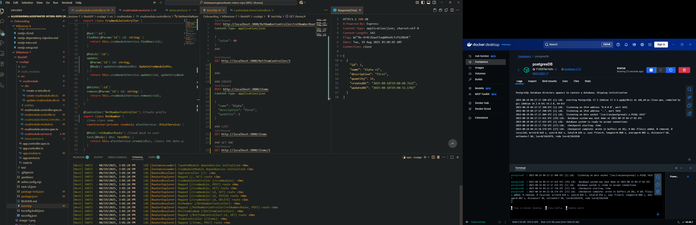

# CRUD operations working

## How does `@nestjs/typeorm` simplify database interactions?

- It allows for mapping between NestJS and postgresql. Instead of constructing raw postgresql queries, we can interact with the database using entities (classes mapped to tables) and repositories that contain services that perform database interaction logic.
- You can use `@InjectRepository()` to inject repositories directly into your services instead of manually creating connections.
- It allows you to organize database logic in a way consistent with other NestJS patterns (modules, providers, controllers).

---

## What is the difference between an entity and a repository in TypeORM?

- An Entity is a class that maps to a database table.
  - Defines the structure of the data (columns, relationships, etc.).
- A Repository is an object provided by TypeORM to interact with a specific entity/table.
  - Provides methods like `find()`, `findOne()`, `save()`, `delete()`, etc. (it is the mapping between NestJS and raw postgresql queries)

---

## How does TypeORM handle migrations in a NestJS project?

- Migrations are scripts that update the database schema (add/remove columns, tables, constraints).
- TypeORM provides CLI commands (`typeorm migration:generate`, `typeorm migration:run`, etc.) to create and apply migrations.
- In a NestJS project, you can define the entities of a database as classes, run `typeorm migration:generate -n MigrationName` to generate a file with SQL changes based on differences between entities, then run `typeorm migration:run` to apply them.
- This ensures the DB schema stays in sync with the code.
- You can use `typeorm migration:revert` to revert your changes.

---

## What are the advantages of using PostgreSQL over other databases in a NestJS app?

- Reliability & Standards Compliance: PostgreSQL is ACID-compliant and supports advanced SQL features.
- Rich Data Types: Supports JSON, arrays, UUID, hstore, and full-text search.
- Quite fast and a robust built-in indexer.
- You can create custom database functions, operators, and even use PostGIS for geospatial queries (mapping data).
- Strong community, so if anything goes wrong there will likely be a solution already posted by said community.
- Production ready and can handle large databases and equally large concurrent queries.
