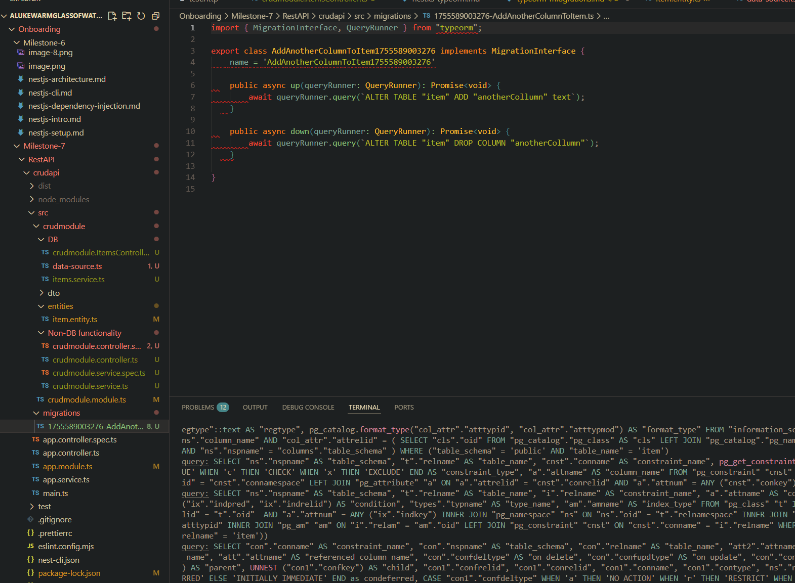
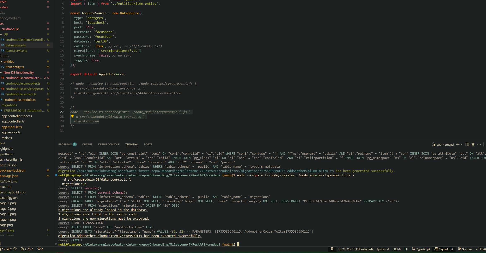
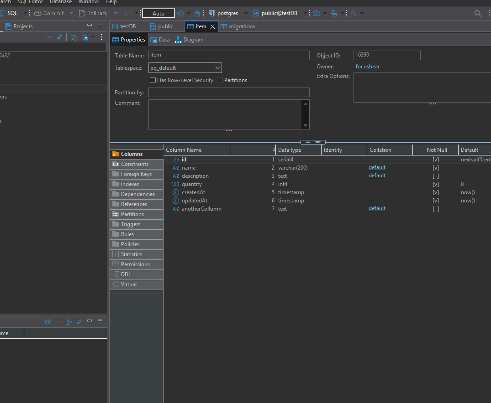
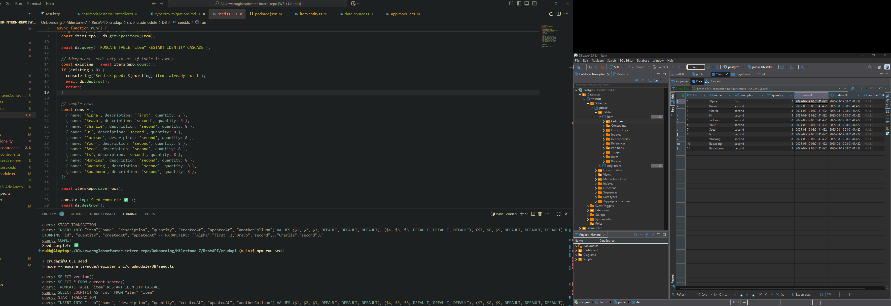

# TypeORM Migrations (NestJS) — How `migration:generate` Works

## What is a migration?

A **migration** is a versioned script (`up`/`down` methods) that changes your database schema (create/alter/drop tables, columns, indexes).  
Instead of relying on `synchronize: true` (unsafe for prod), you **explicitly** evolve the schema and can **rollback**.

---

## Prerequisites (TypeORM v0.3.x+)

- You need a **DataSource** file (not `ormconfig.json` anymore).
- Typical NestJS layout:

# Migration file generated



# Migration running



# New column in table created



# Seed script

```JSON
"typeorm": "node --require ts-node/register ./node_modules/typeorm/cli.js -d src/crudmodule/DB/data-source.ts",
"migration:generate": "npm run typeorm -- migration:generate src/migrations/AutoMigration",
"migration:run": "npm run typeorm -- migration:run",
"migration:revert": "npm run typeorm -- migration:revert",
"seed": "node --require ts-node/register src/crudmodule/DB/seed.ts"
```

# Seed working



# Command notess

## Create migration

```bash
 node --require ts-node/register ./node_modules/typeorm/cli.js \
  -d src/crudmodule/DB/data-source.ts \
  migration:generate src/migrations/AddAnotherColumnToItem
```

## Run migration

```bash
node --require ts-node/register ./node_modules/typeorm/cli.js \
  -d src/crudmodule/DB/data-source.ts \
  migration:run
*/
```

## show migrations

```bash
node --require ts-node/register ./node_modules/typeorm/cli.js \
  -d src/crudmodule/DB/data-source.ts \
  migration:show
```

## Rollback to last migration

```bash
node --require ts-node/register ./node_modules/typeorm/cli.js \
  -d src/crudmodule/DB/data-source.ts \
  migration:revert
```

## Rollforward to earlier state

```bash
node --require ts-node/register ./node_modules/typeorm/cli.js \
  -d src/crudmodule/DB/data-source.ts \
  migration:run
```

# Reflection

### What is the purpose of database migrations in TypeORM?

- They provide a structured way to change the database schema in a safe, autogenerated manner that is more granular than `synchronise: true`
- Instead of manually altering tables, migrations generate SQL commands to keep the schema in sync with the entity classes you have called which ensures consistency across environments

### How do migrations differ from seeding?

- Migrations: Change the _schema_ (add columns, modify tables, create relations).
- Seeding: Inserts or updates (e.g., default users, sample rows).
- Migrations focus changes structure, while seeding focuses on the content contained inside the database structure.

### Why is it important to version-control database schema changes?

- Every schema change is tracked as a migration file /migration.
- This allows changes to be made safely and tracked automatically.
- Version control ensures all environments apply the same schema history in order.

### How can you roll back a migration if an issue occurs?

- Use the TypeORM CLI command:
  ```bash
  node --require ts-node/register ./node_modules/typeorm/cli.js \
    -d src/crudmodule/DB/data-source.ts \
    migration:revert
  ```
