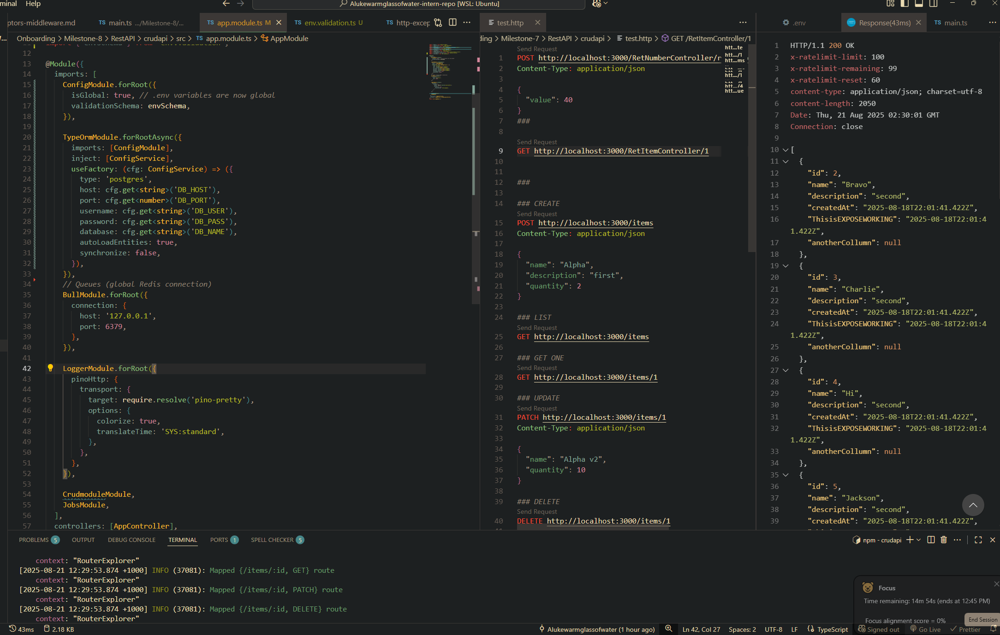

# Secure variables working and validated by joi globally



# Reflection

### How does `@nestjs/config` help manage environment variables?

- Loads values from `.env` (and `process.env`) into a centralized **ConfigService**.
- Supports **schema validation**, default values, caching, and namespaced configs.
- Makes vars injectable anywhere (`constructor(private config: ConfigService) {}`).

### Why should secrets (API keys, DB passwords) never be stored in source code?

- If source code leaks then user data, via API keys, are also leaked.
- Violates least-privilege and auditability.

### How can you validate environment variables before the app starts?

- Install joi, create a schema file and import below in the app module

```js
imports: [
    ConfigModule.forRoot({
      isGlobal: true, // .env variables are now global
      validationSchema: envSchema,
    }),
```

This will validate all global variables required by the module the app.module is responsible for. If a variable is missing/invalid the app will not start.

    - Validation schema example:

```js
    validationSchema: Joi.object({
      PORT: Joi.number().default(3000),
      DATABASE_URL: Joi.string().uri().required(),
      JWT_SECRET: Joi.string().min(32).required(),
    )}
```

### How can you separate configuration for different environments (e.g., local vs. production)?

- Per-environment .env files
  - Keep .env.development, .env.staging, .env.production (all git-ignored) and load based on NODE_ENV via envFilePath.
- Can export/import different configurations via namespaces so only specific config settings are loaded per module.
  - e.g.
  - registerAs('db', () => ({xyz}))
  - registerAs('redis', () => ({xyz}))
  - Then can import into services/modules via import { dbConfig } etc...
- Can use a secret manager to store prod conf/secrets for production only.
