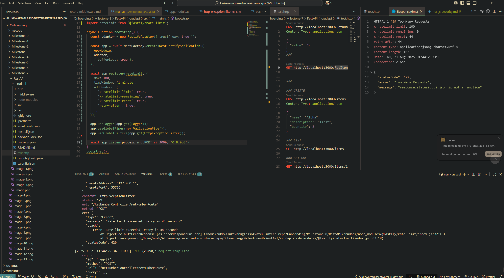

# Research

### Common Security Risks in NestJS

- **Injection Attacks**
  - SQL Injection: unsanitized input reaching database queries.
  - NoSQL Injection: unsafe queries in MongoDB (e.g., directly inserting user objects).
  - Command Injection: passing unchecked input to shell commands.

- **Cross-Origin Resource Sharing (CORS)**
  - User requests can be redirected to different domains.
  - If another website it visited, the session from your application can still be held and the other websites can make malicious requests as you're still technically logged in.
- **Cross-Site Scripting (XSS)**
  - Returning unsanitized user input in responses/templates.
  - Missing input validation/sanitization with `class-validator` or custom pipes.

- **Cross-Site Request Forgery (CSRF)**
  - Allowing state-changing requests without CSRF tokens or proper origin checks.

- **CORS Misconfigurations**
  - Using `app.enableCors({ origin: true })` blindly, exposing APIs to any domain.
  - Not restricting allowed HTTP methods or headers.

- **Insecure Authentication**
  - Storing passwords in plain text instead of hashing (e.g., with bcrypt).
  - Weak session/token handling, missing expiration or rotation.
  - JWTs without proper signing/verification.

- **Broken Authorization**
  - Not enforcing role-based or resource-based access control (RBAC/ABAC).
  - Guard decorators not applied consistently to protected routes.

- **Sensitive Data Exposure**
  - Hardcoding secrets in source code instead of using environment variables.
  - Logging sensitive data (passwords, tokens) with `console.log` or structured logs.

- **Unvalidated Redirects**
  - Dynamically building redirect URLs from user input without validation.

- **Denial of Service (DoS)**
  - Not limiting request body size or rate limiting requests.
  - Running expensive queries without pagination or constraints.

- **Improper Error Handling**
  - Returning full stack traces to clients instead of clean error messages.
  - Leaking database or server details in error responses.

- **Insecure Dependencies**
  - Using outdated NestJS/TypeORM/Express libraries with known vulnerabilities.

- Fastufy/helmet prevents:
  - Clickjacking
  - XSS
  - Enforces HTTPS
  - MIME-like sniffing
  - Hides tech stack automatically
  - Above can be configured depending on needs


### Rate limiting working



### Secure API key handling/env variables guidelines:
- Never commit secrets: .env* files belong in .gitignore.  Treat leaked keys as compromised—rotate immediately.

- Least privilege: create per-service, per-environment keys with only the scopes they need.

- Separate per environment: DEV, STAGING, PROD each get different keys and configs.

- Validate on boot: fail fast if a required env var is missing/invalid.

- Don’t log secrets: redact in logs and error messages.

- Don’t ship secrets to client: work on the principle anything bundled into frontend JS is public.

- Centralize config: one place to read env, cast types, and validate (ConfigModule).

- Can use a secrets manager for storing API keys which runs on your sever.
    - Can use docker secrets.
        - Mounted at runtime in RAM only and encrypted by docker. Can't see them in the code.

e.g. private readonly vars for keys and or env variables. The keys/variables are stored in a secret handling service. Can be called by ConfigService to parse in at runtime.
```js
import { ConfigService } from '@nestjs/config';

@Injectable()
export class YahooService {
  constructor(private readonly cfg: ConfigService) {}

  private readonly clientId = this.cfg.get<string>('YAHOO_CLIENT_ID', { infer: true });
  private readonly clientSecret = this.cfg.get<string>('YAHOO_CLIENT_SECRET', { infer: true });

}
```

# Reflection

### What are the most common security vulnerabilities in a NestJS backend?
- Injection attacks - (SQL/NoSQL, command injection) if inputs aren’t validated.  
- CORS misconfigurations - allowing malicious domains to call APIs.  
- Excessive data exposure (data leaks) - by returning raw entities in either logs/errors or general server responses.  
- Insecure authentication/authorization of users  

### How does @fastify/helmet improve application security?
- Sets secure HTTP headers by default (e.g., `Content-Security-Policy`, `Strict-Transport-Security`).  
- Helps mitigate XSS, clickjacking, and other JS browser-based exploits.  

### Why is rate limiting important for preventing abuse?
- Prevents brute-force login attempts.  
- Stops denial-of-service from excessive requests.  
- Ensures fair usage by throttling clients (depending on application context of course).  

### How can sensitive configuration values be protected in a production environment?
- Use secret managers (AWS/GCP/Azure Vaults) that then parse data into env variables at runtime.  
- Validate values at startup with `Joi`/`Zod`.  
- Mount secrets as files via Docker/Kubernetes secrets.  
- Never commit `.env` files to version control.  
