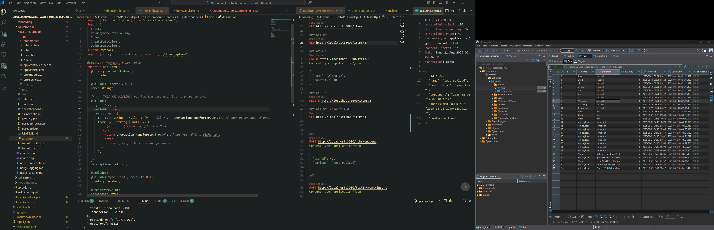

# Encryption and Decryption of the description collumn working

# Reflection

## Why does Focus Bear double-encrypt sensitive data?

- Defense in depth: App-level field encryption enforces protection even if the DB is leaked as all content is already encrypted. Also data transferred between the database to the API (after it unencrypts) is encrypted increasing security.

## How does typeorm-encrypted integrate with TypeORM entities?

- Column transformer: You attach an EncryptionTransformer to a @Column so values are encrypted before insert/update and decrypted on read.
- Normally AES-256-GCM encryption with a per-row random initialization vector and auth tag; encrypted data is stored in the same column.
  Key sourcing: The transformer reads an encryption key from env variable or can be hardcoded however is not best practice.
- TypeORM handles the transform at the persistence boundary making it relatively easy to integrate.

## What are the best practices for securely managing encryption keys?

- Store keys/secrets in AWS KMS/Azure Key Vault, never hardcode keys.
- Rotation policy: Rotate key encryption key on a schedule; rotate data protection keys opportunistically.
- Least privilege: Separate roles for reading/wrapping keys vs. database access.
- Enable key audit logs; alert on unusual decrypt operations.
- Use AEAD (Key + Nonce etc.) (e.g., GCM/ChaCha20-Poly1305), unique initialization vectors per record, and authenticated associated data (AAD) where relevant.
- Back up key metadata (IDs, versions) and test disaster-recovery plans.

## What are the trade-offs between encryption at the database level vs. the application level?

### Database-level (e.g., disk/volume encryption)

- Pros
  - Transparent to app and queries; no code changes.
  - Covers storage at rest and storage snapshots.
  - Low overhead.

- Cons
  - Data can be exposed easily. Encrypted but still present in the DB.
  - Same trust boundary for all workloads using that DB.

### Application-level (field/column encryption in code)

- Pros
  - Protects against DB compromise and backup leaks as only the app can decrypt.

- Cons
  - Can't query the database as easily since everything has to be decrypted. (I guess it depends mainly on how your database is set up)
  - Further app overhead for both the application itself as well as the developers maintaining it as best practices must be followed.
