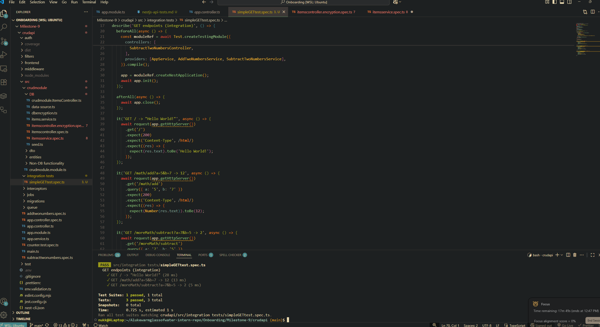
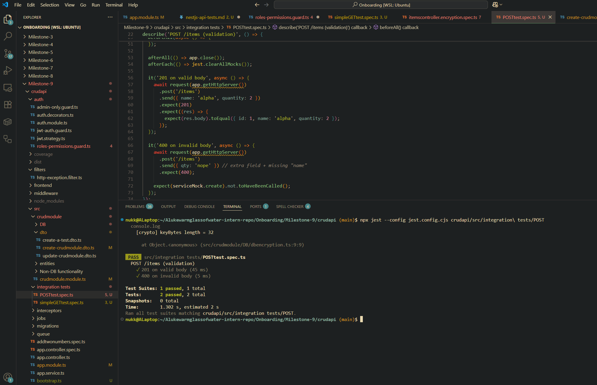
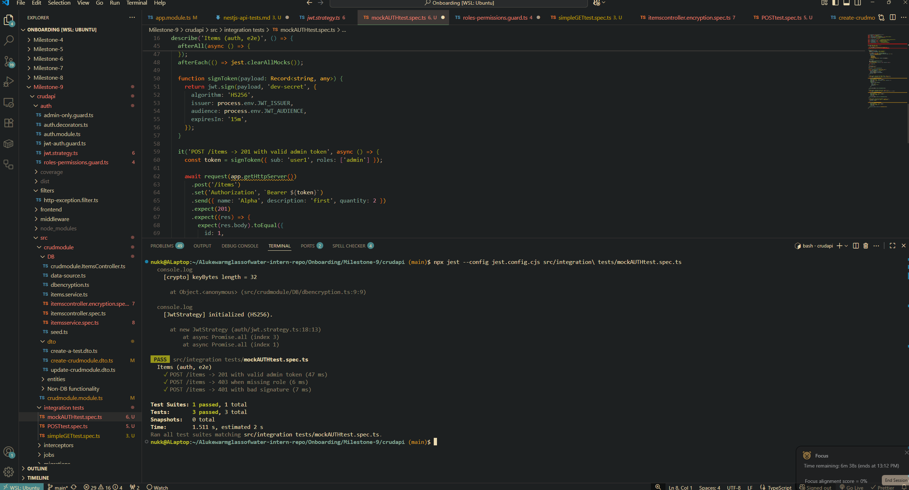

# Integration test for a simple GET API endpoint

# Integration test for a POST API endpoint with request validation

# Integration test mock via java web token (JWT)

# Reflection

## How does Supertest help test API endpoints?

- It lets you make actual HTTP calls to your nest application and assert on returned status, headers, and body.
- Can test the routing, pipes, filers, interceptors and guards in your app and that they are working correctly.
- Can chain requests together so you can test get -> post routes. E.g. user requests info, edits it, then sends it back to the backend.

## What is the difference between unit tests and API tests?

- Unit tests test a single function/class method in your code
- API tests test the entire nest + HTTP layer of your code. Essentially it strings all the 'modules' together to ensure that the handling of sent inputs and returned outputs are what is expected.

## Why should authentication be mocked in integration tests?

- Don't waste time testing authentication when you are usually checking routing, DTO parsing/validation and controller logic.
- Faster than running actual authentication calculations in tests (depending how complicated your authentication plan is of course).
- Easily force testing against different role types via mocking them without actually dealing with the associated tokens/setup.

## How can you structure API tests to cover both success and failure cases?

- Hit every route in your test. From each route then split into a success and failure test path. Potentially add further failure paths as to test edge cases.
  - Can structure variable invalid table entries to see how they behave when being tested and if your routes/services handle them correctly.
  - Test for Header content, returned body is of the correct shape, make sure functions are called by the correct callee, etc...
  - For each endpoint, write tests covering: success (200/201), validation error (400), unauthenticated (401), not found (404), conflict/duplicate (409), and unexpected server error (500)
