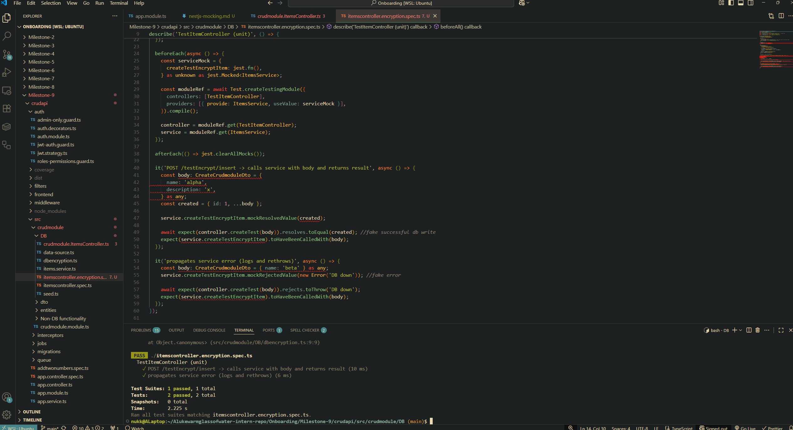
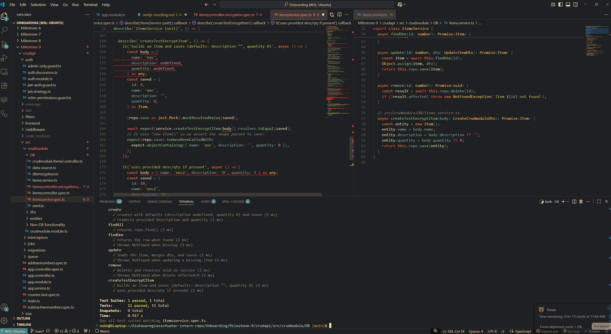

# Mocking DB successful write and errors



# Mocking TypeORM repository in a service



# When to use jest.spyOn() vs jest.fn() in mocks

- .fn creates an entire mock everytime it is called with methods specified
  - Is not a real object you are interacting with
  - remember to jest.clearAllMocks() to reset call history
    - important as call history for a function may be a factor in another function testing successfully or not.
- .spyon only mocks partial methods used in an object
  - method must already exist in the target object since it uses the target object to build the mock.
  - when using .spyon the real object is called until it is stubbed.
    - can stub the mock with fake data that is useful for troubleshooting.
    - means the real object doesn't run once stubbed as it can only return the fake data.
    - remmeber to spy.mockRestore()
      -may persist against tests later in the code so to make sure the mock doesn't interfere with anything you need to restore the original version.

# Reflection

# Why is mocking important in unit tests?

- Isolates the unit under test so failures point to your code, not infra.
- Makes tests fast & deterministic (no network/DB/filesystem).
- Lets you force edge cases (timeouts, “not found”, duplicates) on demand.
- Encourages good design (loosely-coupled, dependency-injected code is easier to mock).

# How do you mock a NestJS provider (e.g., a service in a controller test)?

- when describing the jest function, you `let service: jest.Mocked<ItemsService>;`.
- You can then assign a value to this service e.g.

  ```js
  beforeEach (async () => {
      const serviceMock: jest.Mocked<Partial<ItemsService>> = {
          findAll: jest.fn().mockResolvedValue([{ id : 1}])
      }
  })
  ```

  - The above creates a constant called serviceMock that, inside it, the findAll object will always return an ` id: 1` value.
  - This can then be injected in a later module reference construction then specified as a mock version of ItemsService e.g.

  ```js
    const moduleRef = await Test.createTestingModule({
    controllers: [ItemsController],
    providers: [{ provide: ItemsService, useValue: serviceMock }], // <-- DI wiring
  }).compile();

  controller = moduleRef.get(ItemsController);
  service = moduleRef.get(ItemsService) as jest.Mocked<ItemsService>;
  });

  ```

# What are the benefits of mocking the database instead of using a real one?

- Faster to test against rather than using actual DB instances.
- Stable in comparison to a database which could be experiencing technical issues.
- Can more easily generate edge-cases to test against.
- Tests only service logic. Not how well configured your database is/infrastructure.

# How do you decide what to mock vs. what to test directly?

- Test directly (real):
  - The unit’s own logic (pure functions, service methods).
  - Lightweight value objects/utilities with no I/O.

- Mock:
  - External entities such as DB repositories, HTTP clients, caches, queues, file system, time/UUID.
  - Framework edges in unit tests (guards/pipes/interceptors) — provide mock data as you are testing logic not that these handlers are working correctly.
