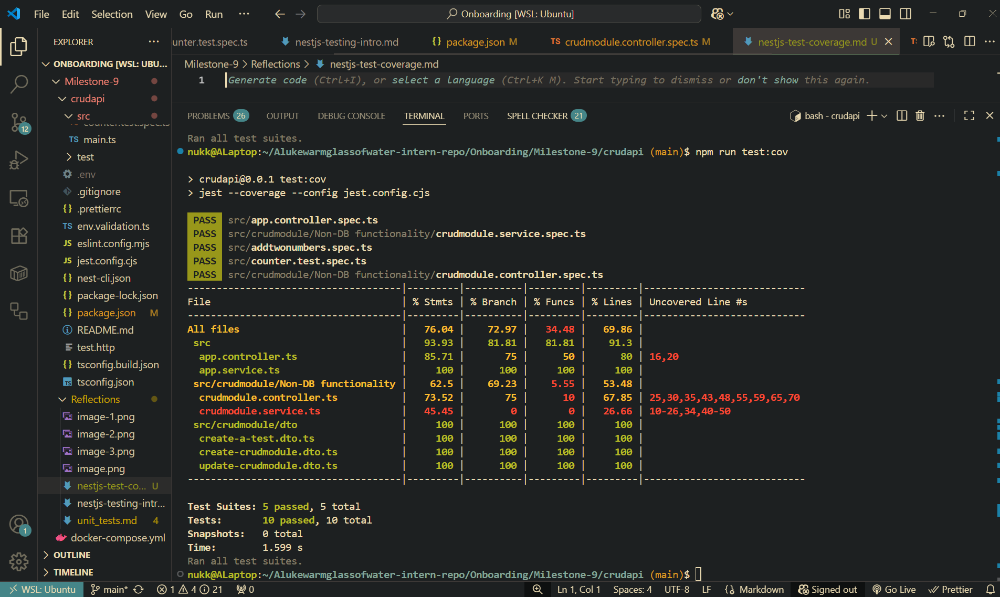
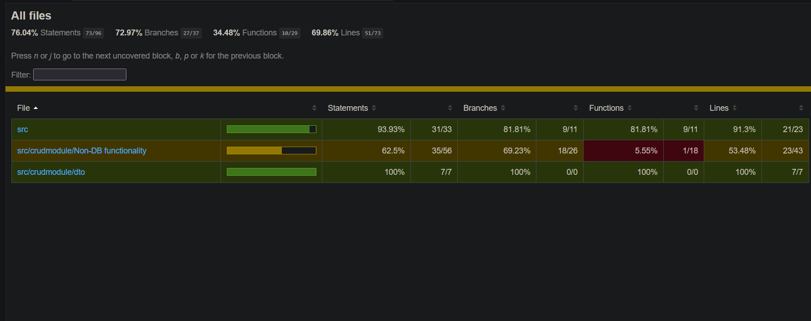
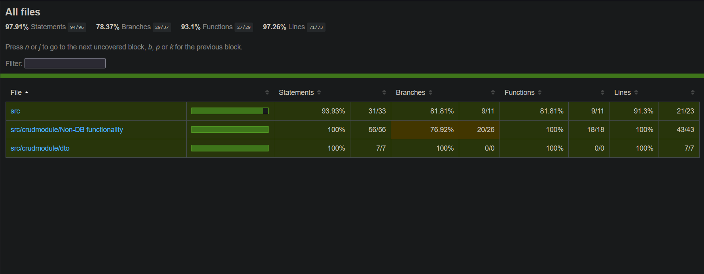

# Coverage report



# Fixed coverage report

Refactored crudmodule.service.spec.ts, crudmodule.controller.spec.ts and app.controller.spec.ts. As such coverage improved. Not sure how to get %branch to improve as it seems all functions and lines are being covered?



# Test without meaningful insertions

```ts
import { Counter } from './app.service';

describe('Counter', () => {
  let counter: Counter;

  beforeEach(() => {
    counter = new Counter(); // starts at 0
  });

  it('starts at 0 by default', () => {
    expect(counter.value).toBe(0);
  });

  it('increments by 1 by default', () => {
    counter.increment();
    expect(counter.value).toBe(1);
  });

  it('increments by a custom step', () => {
    counter.increment(5);
    expect(counter.value).toBe(5);
  });

  it('decrements by 1 by default', () => {
    counter.increment(2);
    counter.decrement();
    expect(counter.value).toBe(1);
  });

  it('resets to 0', () => {
    counter.increment(3);
    counter.reset();
    expect(counter.value).toBe(0);
  });
});
```

# Better test

```js
import { Counter } from './app.service';

describe('Counter', () => {
  it('starts at 0 by default', () => {
    const c = new Counter();
    expect(c.value).toBe(0);
  });

  it('honors custom initial value', () => {
    const c = new Counter(10);
    expect(c.value).toBe(10);
  });

  it('increment() returns the new value and updates state', () => {
    const c = new Counter();
    expect(c.increment()).toBe(1); // return value
    expect(c.value).toBe(1); // state
  });

  it('increment(step) with custom step', () => {
    const c = new Counter();
    expect(c.increment(5)).toBe(5);
    expect(c.value).toBe(5);
  });

  it('decrement() returns the new value and updates state', () => {
    const c = new Counter(2);
    expect(c.decrement()).toBe(1);
    expect(c.value).toBe(1);
  });

  it('decrement(step) with custom step', () => {
    const c = new Counter(5);
    expect(c.decrement(2)).toBe(3);
    expect(c.value).toBe(3);
  });

  it('reset() sets value to 0 and returns void', () => {
    const c = new Counter(3);
    expect(c.reset()).toBeUndefined(); // assert void
    expect(c.value).toBe(0);
  });

  it('zero step is a no-op', () => {
    const c = new Counter(7);
    expect(c.increment(0)).toBe(7);
    expect(c.value).toBe(7);
    expect(c.decrement(0)).toBe(7);
    expect(c.value).toBe(7);
  });

  it('inc(n) then dec(n) returns to original', () => {
    const c = new Counter(4);
    c.increment(3);
    c.decrement(3);
    expect(c.value).toBe(4);
  });

  it('negative steps behave like the opposite operation', () => {
    const a = new Counter(10);
    const b = new Counter(10);
    a.increment(-3);
    b.decrement(3);
    expect(a.value).toBe(b.value);
  });

  it('supports floating point steps', () => {
    const c = new Counter(1);
    expect(c.increment(2.5)).toBe(3.5);
    expect(c.decrement(0.5)).toBe(3.0);
  });
});
```

# Reflection

## What does the coverage bar track, and why is it important?

What it tracks

- Tracks how many lines are executed.
- Each function/method was called.
- How many function paths are executed. E.g. if/else, && etc.
- If each statement is executed at least once.
- Effectively test all logical paths of code. Adding further edge cases tests/test scenarios increases coverage.

## Why does Focus Bear enforce a minimum test coverage threshold?

- Ensures that the code you introduce doesn't break other functions (ensures code paths are still ran).
- Allows for safe pull request merging if the new code passes all current tests to a high coverage rate.

## How can high test coverage still lead to untested functionality?

- Lines are executed by outcomes are not verified nor testes against edge cases.
- Mocks are used to cover functionality issues with external technologies. So when code actually runs in the wild those 'tested' external tools don't function correctly, breaking the code base as a result.
- No tests for errors, boundary values, timeouts, or alternative branches. "Easiest" testable path is only tested for.
- Testing decorators and or template generated code increases coverage without any meaningul impact.
- Integration testing forgone for unit testing only. Module-to-module testing not incorporated leaving the entire code base vulnerable to bugs.

## What are examples of weak vs. strong test assertions?

- Weak

- Expect(something).toBeDefined() or toBeTruthy() when you can check exact values.
- Only checking call counts of functions without verifying arguments or outcomes.
- Asserting implementation details (how it does something) not its actual behaviour (what it returns/actual output)
  Asserting on implementation details (private fields, internal steps) instead of behavior.

## How can you balance increasing coverage with writing effective tests?

- Prioritize behavior over lines tested again. Write tests that capture requirements and expected output.
- Make sure 'happy path' logic is tested for initially. Then move on to edge cases/errors.
- Make sure all three levels of testing (e.g. Unit, Module and E2E) are tested for.
- Mock external systems minimally. Don't mock for fear of spotty external system functionality.
- Test as many branches as possible.
- Test with strong assertion. E.g. output is correct, edge cases don't break functionality, collaborator arguments are as to be expected.
