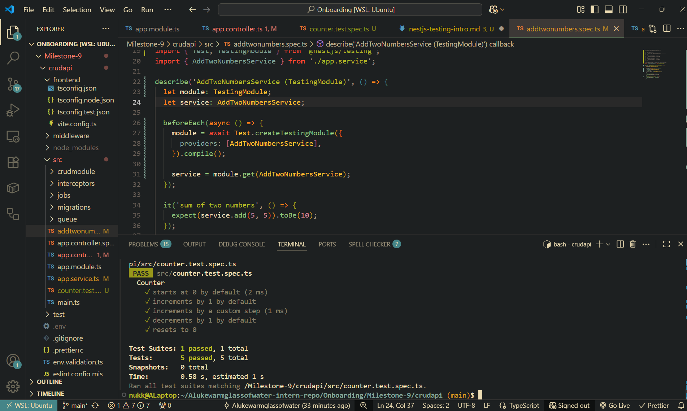

# Test ran and passed for Counter class

## What are the key differences between unit, integration, and E2E tests?

- Unit tests are a simple, single purpose function test.
- Integration tests are when multiple modules are connected together for testing but entities such as external APIs and datbases are mocked.
- End-to-end tests are when the entire full stack function flow is tested. Normally simulates what a real user would experience/software running in production.

## Why is testing important for a NestJS backend?

- Catch bugs early (logic, validation, auth) before they hit prod.
- Prevent regressions when refactoring code segments. Must pass all tests/have full functionality for both the new feature and past features.
- Documents code behavior and what is expected.
- Ensures data is being parsed correctly. Can check against XSS attacks/code injection.

## How does NestJS use @nestjs/testing to simplify testing?

- Allows you to substantiate external dependencies such as databases and or API tokens for example.
  - E.g. mock external dependencies
- Can override framework guards/pipes/interceptors for the purpose of testing
- Lets you actually run an instance of the service. If the test had injected dependencies then the test would fail without this since the DI backend of NestJS couldn't interact with it (builds a small nest container which you test runs inside)

## What are the challenges of writing tests for a NestJS application?

- Can have differences between Express vs Fastify nuances.
- Keeping track of dependency injection flow can get difficult.
- Difficult to keep track of async timings for completes NestJS applications if testing E2E.
- Exactly replicating environments in both testing and development.
- Updating mocks/tests as the code changes.
- Difficult to exactly replicate decorator and dynamic module metadata (e.g. request-lifecycle context/environment state, configuration-dependent execution of NestJS modules) leading to tests that are hard to debug when they fail.
- Need to factor in the affects of global guards/pipes/interceptors when running tests and accounting for them.
