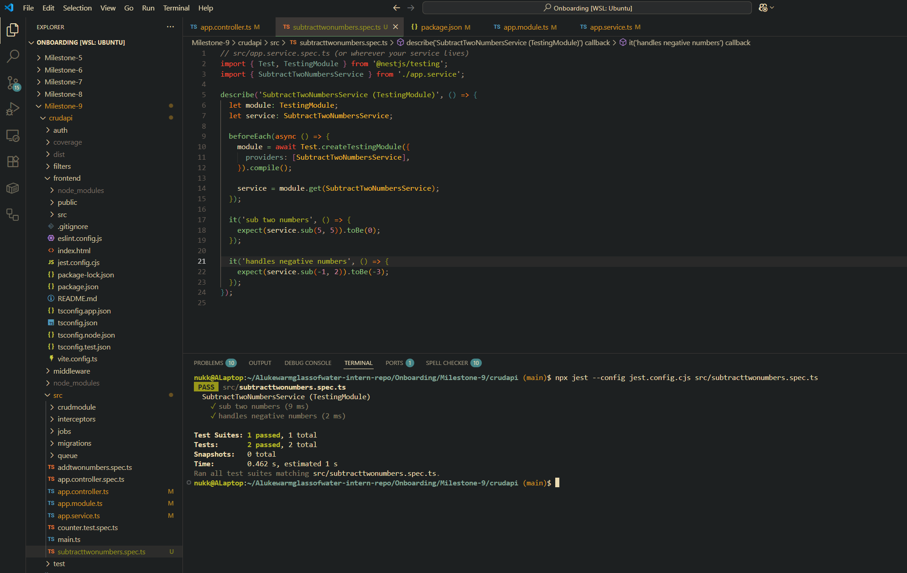
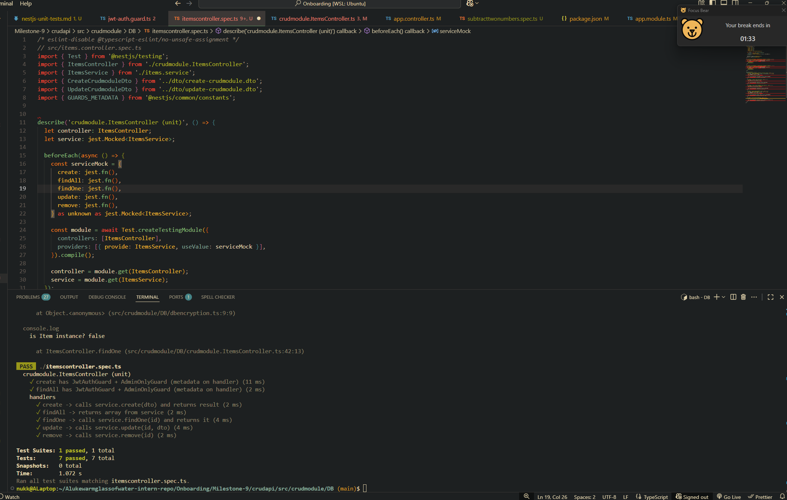

# Simple unit test

# Unit test for a controller method handling API requests. itemsservice is mocked.

# Reflection

## Why is it important to test services separately from controllers?

- Services hold logic while controllers handle HTTP routes. Separate testing helps ensure functionality for both.
- Faster tests is ran on the service only.
- Easier to diagnose without auth/validation handlers that normally run in the controller. Also don't have to handle the middleware/interceptors.

## How does mocking dependencies improve unit testing?

- Tests the code only not the infrastructure it relies on. Therefore if there is a failure, its can be pinpointed to the code only.
- Faster than waiting for external dependencies to respond.
- Can mock edge case input values that would otherwise be hard to replicate with a real externel dependency.

## What are the common pitfalls when writing unit tests in NestJS?

- Testing with real infrastructure in a test that is only intended to test the single unit.
- Testing internal functions only while failing to test actual output.
- Failing to correctly await code that uses async.
- Overtesting in terms of connecting other modules. Not the point of unit testing.
- Mock external dependencies (DB/repos, HTTP clients, caches, queues), but never mock the method under test. Verify observable outcomes, not internals.
- Testing the correct path only. Failing to test for edge cases.

## How can you ensure that unit tests cover all edge cases?

- Use the Jest coverage bar output.
  - Specifically Branch coverage, not just the amount of lines tested.
- Attempt to test for as many edge cases as possible. Start with what expected input/output should be then branch out from there.
