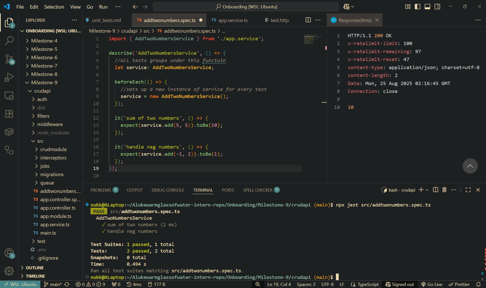
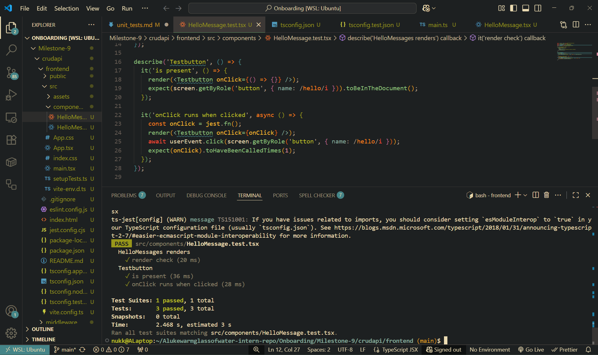

# Simple test created and ran successfully

# Reflection

## Why is automated testing important in software development?

- Unit testing is important as it allows for code edge cases to be caught before they occur in production.
- Automated testing via jest allows new code to be tested to ensure it is able to provide a base standard of functionality.
- Ensures that previously working code doesn't fail if functionality of the codebase is expanded.
- Also test files can be seen as documentation that outlines how functions and code is expected to behave.

## What did you find challenging when writing your first Jest test?

- I am having a difficult time remembering Jest syntax and how the tests actually work. The Jest framework is so streamlined it is difficult to understand what is actually happening under the hood. E.g. the expect() service must run the service, parse in specified values then check the return against a specified output. The more I play with the framework the more it makes sense however at a first glance it appeared unintuitive.

# Testing React Componenst with Jest & React testing library:

## Message renders correctly and onclick works as expected

## Reflection

### What are the benefits of using React Testing Library instead of testing implementation details?

- Testing implementation does not test how the user interacts with the page more so test the functionality of the page itself. E.g. Click button 1 -> button clicked -> test passed
- Using React testing Library actually renders the page and 'finds' the elements you are testing for by specifying an attribute of that element. More robust than just testing if site components function correctly.
- It queries the document object model (DOM) via aria-label elements.
- If page functionality changes but the roles are still assigned to the page elements, then the tests will still run correctly
- Can check if UI elements change. The test may pass when testing implimentation details but fails with React testing library. Therefore it is more robust. (e.g. dialog box renders, element on page moves etc.)

### What challenges did you encounter when simulating user interaction?

- I found it difficult to understand how getByRole works. I now understand it is using the accessible name property tied to the element. In the case of the button the accessible name is 'hello' given this is what is rendered inside the button. The button looks for if "hello" is present inside a button and if so attempts the userEvent.click function on the button. It then waits to see if the onClick function has been called once. If so test has passed.
- Also learnt how to create a user event which mirrors user input more closely than fireEvent.
  E.g.: - userEvent.click does pointerdown -> mousedown -> focus -> pointerup -> mouseup -> click (events that would actually occur in the browser when the user clicks. More robust as a result.) - fireEvent.click just fires the click event
